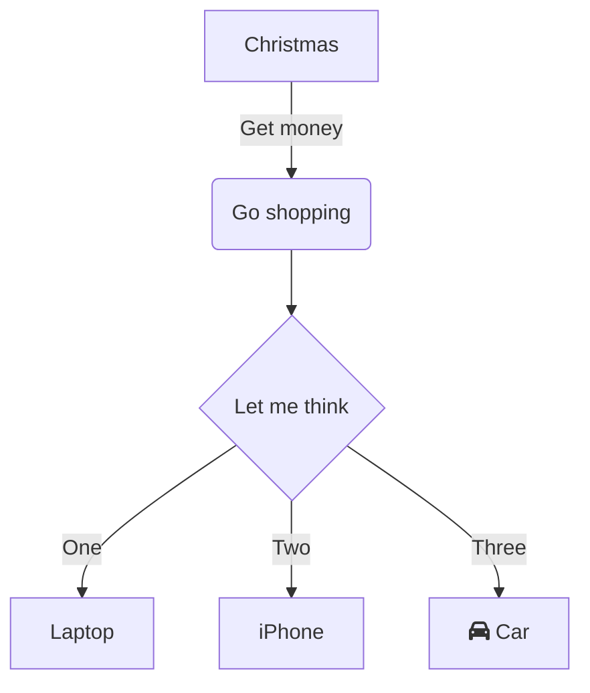
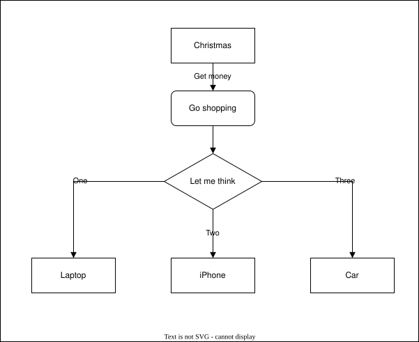

# 0. Template for Architecture Decision Records (ADR)

#### Date:
`YYYY-MM-DD`

#### Status
`Proposed`, `Accepted`, `Rejected`, `Superseded BY [Another ADR ID]`

#### Related Ticket
`N/A`
[MSA-NNN](url-to-jira-ticket)
---

## Context

---

## Decision

---

## Consequences

### Positive:
- .....
- .....

### Negative:
- .....
- .....

---

## [optional] Implementation Notes

---

## [optional] Alternatives Considered

- .....
- .....

## Embedded Attachments

### Mermaid Diagram

-  can use `
 
` to scale down the diagram

### Images

### .drawio.svg Diagrams (Editable)

### Links to Files

For those without a preview, use the following syntax to link to files:

- [Hello Text](hello.txt)
- [Diagram.drawio](diagram.drawio)
