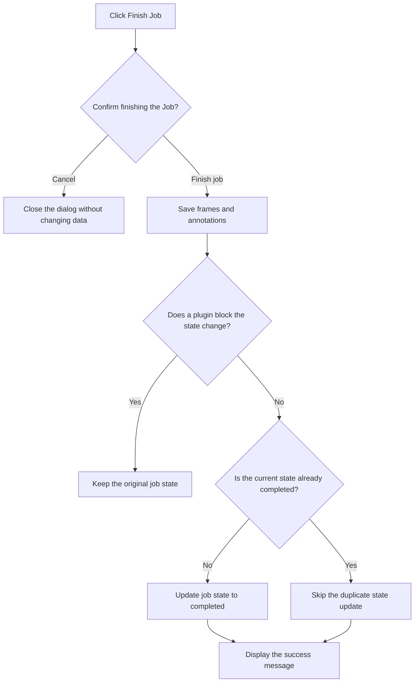

# 1. Provide a Finish Job Button in the Annotation Top Bar

[繁體中文](README.md) | **English**

#### Date:
`2026-02-23`

#### Status
`Accepted`

#### Related Ticket
[MSA-736](https://smartsurgerytek.atlassian.net/browse/MSA-736)

- [PR #12 — Review workflow enhancements](https://github.com/smartsurgerytek/sst-cvat/pull/12)
- [Source branch — MSA-736-737-738-feature-batch](https://github.com/smartsurgerytek/sst-cvat/tree/MSA-736-737-738-feature-batch)

---

## Context

PR #12 includes MSA-736, MSA-737, and MSA-738. This ADR documents only the MSA-736 **Finish Job button**;
it does not cover Raw Frame Compare or Issue Mask.

Before this change, users could already select **Finish the job** from the Annotation page Actions menu, and the shared
`finishCurrentJobAsync` flow was already available. That flow first saves the annotations and then updates the job state
to `completed`. However, the Finish Job action was hidden inside a menu, so users could not immediately identify or
invoke it from the primary action bar.

We need to provide a more discoverable entry point without duplicating domain logic or adding a backend API. Because
finishing a Job writes annotations and changes persistent state, we must also retain an explicit confirmation step to
reduce the risk of accidental activation.

This decision changes only the **job state**; it does not change the CVAT **job stage**.

---

## Decision

Add a **Finish Job** button with a check-circle icon and text to the left group of the shared Annotation top bar,
next to primary actions such as Menu, Save, Undo, and Redo.

Adopt the following behavior:

1. Disable the button while `saving` is `true` to prevent duplicate activation during a save.
2. After the button is clicked, display a confirmation dialog that clearly explains that the system will save
   annotations and set the job state to `completed`.
3. When **Cancel** is selected, close the dialog without saving or changing any state.
4. When **Finish job** is selected, dispatch the existing `finishCurrentJobAsync` through the top-bar container instead
   of implementing the finish logic inside the UI component.
5. The shared flow performs the following steps in order:
   - save frame and annotation changes;
   - execute the `beforeJobFinish` plugin callbacks;
   - if no plugin blocks the operation and the current job state is not already `completed`, update it to `completed`;
   - display a success message for one second after completion.
6. Retain the existing **Finish the job** entry in the Actions menu to preserve the current user flow; both entry points
   share the same Redux thunk.
7. Do not add a Finish-specific backend endpoint, database table, migration, or schema.

Although the PR and Cypress spec validate this feature in the context of the Review workflow, the button itself has no
`workspace === Review` condition. It therefore appears in every Annotation workspace that uses this top bar.

---

## Consequences

### Positive:

- Users can find the Finish Job action directly in the primary action bar, eliminating the extra step of opening the
  Actions menu.
- The button text and confirmation dialog clearly communicate the effect: save first, then finish the Job.
- Reusing the existing save, plugin hook, job state update, and error handling paths avoids creating a second set of
  domain logic.
- The `saving` state and confirmation dialog reduce the risks of duplicate operations and accidental activation.
- No backend or data model changes are required; the integration scope is limited to the frontend entry point and tests.

### Negative:

- The top bar and Actions menu both provide a Finish Job entry point. Their confirmation dialog and success-message UI
  wiring are duplicated and could diverge in wording or behavior over time.
- The button consumes horizontal space in a fixed-height action bar; layouts on narrow screens and in different
  workspaces still require additional validation.
- The button is not hidden based on workspace, permissions, or completed state. Clicking it again for an already
  completed Job still saves and displays a success message; only the duplicate state update is skipped.
- Saving annotations and updating the job state are sequential operations rather than a single transaction. Annotations
  may already have been saved when a plugin veto or a subsequent state update failure leaves the Job in its original
  state.
- A plugin veto occurs after saving. It currently stops the finish flow without displaying a success message, and the
  top-bar entry point provides no additional explanation of the veto.
- `onFinishJob` does not return the dispatch promise to the confirmation dialog, so the Modal does not wait for the full
  asynchronous flow; progress and error feedback still depend on the existing Redux UI and notification mechanisms.

---

## Implementation Notes

| Responsibility | File |
| --- | --- |
| Button, disabled state, and confirmation dialog | [`left-group.tsx`](../../../cvat-ui/src/components/annotation-page/top-bar/left-group.tsx) |
| Pass `onFinishJob` into the left group | [`components/.../top-bar.tsx`](../../../cvat-ui/src/components/annotation-page/top-bar/top-bar.tsx) |
| Dispatch the finish flow and display the success message | [`containers/.../top-bar.tsx`](../../../cvat-ui/src/containers/annotation-page/top-bar/top-bar.tsx) |
| Shared save and Finish Job flow | [`annotation-actions.ts`](../../../cvat-ui/src/actions/annotation-actions.ts) |
| Finish Job button Cypress spec | [`review_controls_finish_button.js`](../../../tests/cypress/e2e/features2/review_controls_finish_button.js) |

Relevant Git history:

- `29e07c303`: Add the top-bar Finish Job entry point and Cypress spec.
- `a28b777b0`: Adjust the button, tooltip, and confirmation-dialog wording, and set the Cypress viewport to 1920 × 1080.
- `5d1e23f10`: Merge PR #12 into `sst-main`.

The current Cypress spec for the direct button validates only that:

- in the Review workspace with a 1920 × 1080 viewport, the button exists and can be operated;
- clicking it displays the expected confirmation dialog and two action buttons;
- selecting **Cancel** closes the dialog.

The spec does **not yet** validate annotation persistence, the job state update, the success message, plugin vetoes,
error handling, repeated completion, other workspaces, permission differences, or responsive layout after
**Finish job** is pressed. These items must not be considered verified based on static inspection or the existing
cancel-path test.

Run the existing spec independently with:

```bash
cd tests
yarn run cypress:run:chrome --spec cypress/e2e/features2/review_controls_finish_button.js
```

---

## Alternatives Considered

- **Keep only Finish the job in the Actions menu**: This would avoid consuming top-bar space, but the action would
  remain less discoverable and would require opening the menu each time.
- **Use Change job state to set the state directly to completed**: This could reuse the state menu, but that path only
  updates the state and cannot guarantee that pending annotations are saved first.
- **Finish immediately without a confirmation dialog**: This would require fewer steps, but accidental activation could
  write annotations and change persistent state.
- **Add a transactional Finish Job backend API**: This could provide stronger consistency between saving and the state
  change, but it would expand the API, backend, and compatibility scope. The existing shared flow satisfies this
  requirement.

## Embedded Attachments

### Finish Job Flow

<div style="zoom:75%;">



</div>
