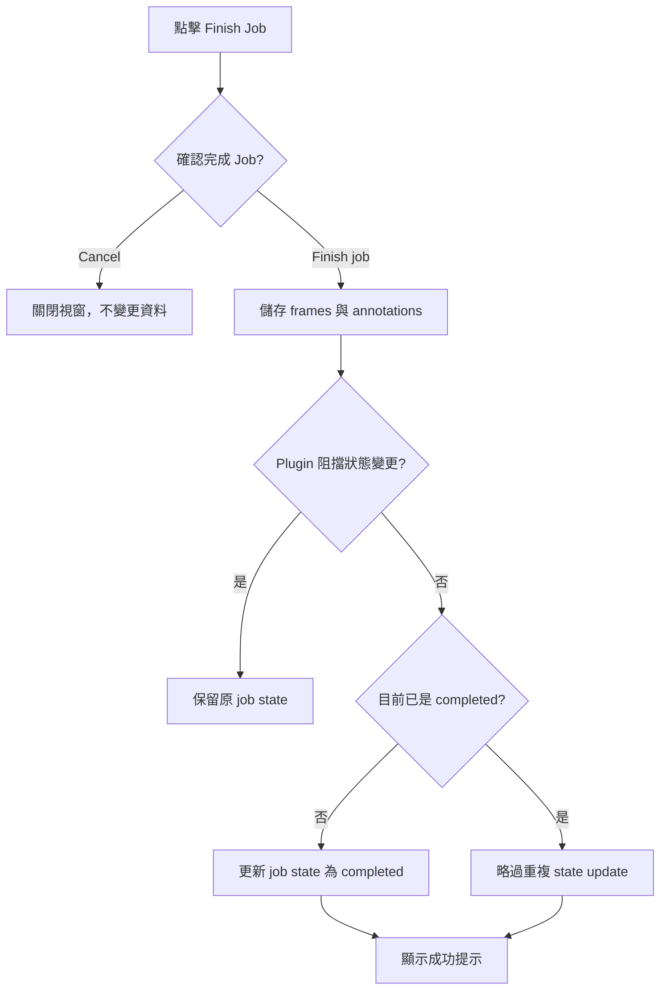

# 1. 在 Annotation Top Bar 提供 Finish Job 按鈕

#### Date:
`2026-02-23`

#### Status
`Accepted`

#### Related Ticket
[MSA-736](https://smartsurgerytek.atlassian.net/browse/MSA-736)

- [PR #12 — Review workflow enhancements](https://github.com/smartsurgerytek/sst-cvat/pull/12)
- [來源分支 — MSA-736-737-738-feature-batch](https://github.com/smartsurgerytek/sst-cvat/tree/MSA-736-737-738-feature-batch)

---

## Context

PR #12 同時包含 MSA-736、MSA-737 與 MSA-738；本 ADR 僅記錄 MSA-736 的 **Finish Job button**，不涵蓋 Raw Frame Compare 或 Issue Mask。

在此變更之前，Annotation page 已經可以從 Actions menu 選擇 **Finish the job**，並已有共用的 `finishCurrentJobAsync` 流程。該流程會先儲存標註，再將 job state 更新為 `completed`。然而，完成 Job 的操作藏在選單內，使用者無法從主要操作列直接辨識與執行。

我們需要在不複製 domain logic、不新增後端 API 的前提下，提供較容易發現的入口。同時，完成 Job 會寫入標註並改變持久化狀態，因此必須保留明確的確認步驟，降低誤觸風險。

本決策只改變 **job state**，不改變 CVAT 的 **job stage**。

---

## Decision

在共用 Annotation top bar 的 left group 新增帶有 check-circle icon 與文字的 **Finish Job** 按鈕，位置緊鄰 Menu、Save、Undo 與 Redo 等主要操作。

採用以下行為：

1. 按鈕在 `saving` 為 `true` 時停用，避免儲存期間重複觸發。
2. 點擊按鈕後顯示確認視窗，清楚說明系統將儲存標註並把 job state 設為 `completed`。
3. 選擇 **Cancel** 時關閉視窗，不執行任何儲存或狀態變更。
4. 選擇 **Finish job** 時，透過 top-bar container dispatch 既有的 `finishCurrentJobAsync`，不在 UI component 內自行實作完成邏輯。
5. 共用流程依序執行：
   - 儲存 frame 與 annotation 變更；
   - 執行 `beforeJobFinish` plugin callbacks；
   - 若 plugin 未阻擋，且目前 job state 尚非 `completed`，則更新為 `completed`；
   - 完成後顯示一秒的成功提示。
6. 保留 Actions menu 中原有的 **Finish the job** 入口，以維持既有使用流程；兩個入口共用同一個 Redux thunk。
7. 不新增 Finish-specific backend endpoint、資料表、migration 或 schema。

雖然 PR 與 Cypress spec 將此功能放在 Review workflow 脈絡下驗證，按鈕本身沒有 `workspace === Review` 條件，因此實際上會出現在所有使用此 top bar 的 Annotation workspaces。

---

## Consequences

### Positive:

- 使用者可在主要操作列直接找到完成 Job 的操作，減少開啟 Actions menu 的步驟。
- 按鈕文案與確認視窗明確表達「先儲存，再完成 Job」的效果。
- 沿用既有的儲存、plugin hook、job state 更新與錯誤處理路徑，避免產生第二套 domain logic。
- `saving` 狀態與確認視窗可降低重複操作及誤觸造成的風險。
- 不需要後端或資料模型變更，整合範圍集中在前端入口與測試。

### Negative:

- Top bar 與 Actions menu 都提供完成 Job 的入口，確認視窗與成功提示的 UI wiring 有重複，未來文案或行為可能漂移。
- 按鈕會佔用固定高度操作列的水平空間；窄螢幕與不同 workspace 的排列仍需額外驗證。
- 按鈕未依 workspace、權限或已完成狀態隱藏；已完成的 Job 再次點擊時仍會先儲存並顯示成功提示，只會略過重複的 state update。
- 儲存標註與更新 job state 是循序操作，不是單一 transaction。標註可能已儲存，但 plugin veto 或後續 state update 失敗，使 Job 保持原狀態。
- Plugin veto 發生在儲存之後，目前會停止完成流程且不顯示成功提示，頂部入口沒有額外的 veto 說明。
- `onFinishJob` 沒有把 dispatch promise 回傳給確認視窗，因此 Modal 不會等待整個非同步流程；進度與錯誤回饋仍依賴既有 Redux UI 與 notification 機制。

---

## Implementation Notes

| 責任 | 檔案 |
| --- | --- |
| 按鈕、disabled 狀態與確認視窗 | [`left-group.tsx`](../../../cvat-ui/src/components/annotation-page/top-bar/left-group.tsx) |
| 將 `onFinishJob` 傳入 left group | [`components/.../top-bar.tsx`](../../../cvat-ui/src/components/annotation-page/top-bar/top-bar.tsx) |
| Dispatch 完成流程與顯示成功提示 | [`containers/.../top-bar.tsx`](../../../cvat-ui/src/containers/annotation-page/top-bar/top-bar.tsx) |
| 共用儲存與完成 Job 流程 | [`annotation-actions.ts`](../../../cvat-ui/src/actions/annotation-actions.ts) |
| Finish Job 按鈕 Cypress spec | [`review_controls_finish_button.js`](../../../tests/cypress/e2e/features2/review_controls_finish_button.js) |

相關 Git 歷史：

- `29e07c303`：新增 top-bar Finish Job 入口與 Cypress spec。
- `a28b777b0`：調整按鈕、tooltip、確認視窗文案，並固定 Cypress viewport 為 1920 × 1080。
- `5d1e23f10`：PR #12 合併至 `sst-main`。

目前的直接按鈕 Cypress spec 只驗證：

- 在 Review workspace、1920 × 1080 viewport 中，按鈕存在且可操作；
- 點擊後會顯示預期的確認視窗與兩個操作按鈕；
- 選擇 **Cancel** 後視窗關閉。

該 spec **尚未**驗證按下 **Finish job** 後的 annotation persistence、job state update、成功提示、plugin veto、錯誤處理、重複完成、其他 workspace、權限差異或響應式版面。這些項目不能因靜態檢查或現有 cancel-path 測試而視為已通過。

單獨執行現有 spec：

```bash
cd tests
yarn run cypress:run:chrome --spec cypress/e2e/features2/review_controls_finish_button.js
```

---

## Alternatives Considered

- **只保留 Actions menu 的 Finish the job**：不增加 top-bar 空間，但操作較不易發現，且每次需額外開啟選單。
- **直接使用 Change job state 將狀態改為 completed**：可沿用狀態選單，但該路徑只更新 state，無法保證先儲存待提交的標註。
- **不顯示確認視窗，點擊後立即完成**：步驟較少，但容易因誤觸寫入標註並改變持久化狀態。
- **新增 transaction 型的後端 Finish Job API**：可讓儲存與狀態變更具有更強的一致性，但需擴大 API、後端與相容性變更；本需求可由既有共用流程滿足。

## Embedded Attachments

### Finish Job Flow

<div style="zoom:75%;">



</div>
