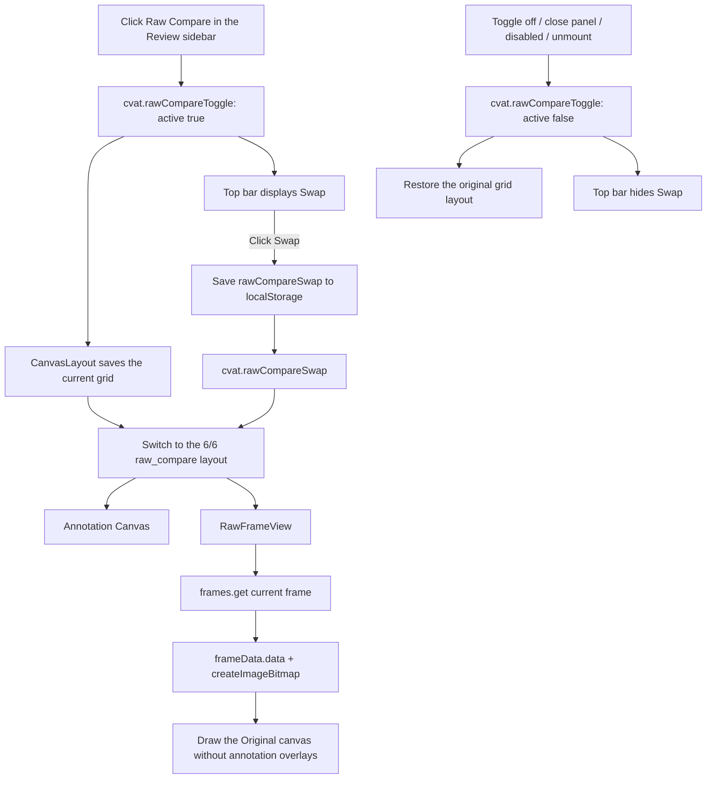

# 2. Provide Raw Compare for Original-Image Comparison in the Review Workspace

[繁體中文](README.md) | **English**

#### Date:
`2026-02-23`

#### Status
`Accepted`

#### Related Ticket
[MSA-737](https://smartsurgerytek.atlassian.net/browse/MSA-737)

- [PR #12 — Review workflow enhancements](https://github.com/smartsurgerytek/sst-cvat/pull/12)
- [Source branch — MSA-736-737-738-feature-batch](https://github.com/smartsurgerytek/sst-cvat/tree/MSA-736-737-738-feature-batch)

---

## Context

PR #12 includes MSA-736, MSA-737, and MSA-738. This ADR documents only the MSA-737 **Raw Compare** feature; it does not cover Finish Job or Issue Mask, nor does it cover the touch gestures and dual-panel enhancements from the subsequent MSA-739 Reviewer tablet branch.

The Review workspace originally displayed only the Canvas with annotation overlays, together with any related/context images separately provided by the task. When reviewers needed to determine whether annotations obscured, deviated from, or incorrectly interpreted the image content, they had no way to view the annotation result alongside an image without annotation overlays for the same frame.

We need to preserve the existing Review canvas and grid-layout behavior while providing a side-by-side visual comparison for 2D Jobs, and restore the user's previous grid configuration after comparison mode is closed. This feature does not calculate annotation diffs, IoU, or conflicts, and it does not modify any annotation data.

The interface uses **Original** to mean the currently displayed frame supplied by the CVAT frame API without annotation overlays. It is not guaranteed to contain the lossless bits of the originally uploaded file and may still come from CVAT's compression or decoding pipeline.

---

## Decision

Add a **Raw Compare** eye icon to the left controls sidebar in the Review workspace, and use the existing grid layout to create a two-column view containing the Annotation Canvas and the Original frame.

Adopt the following behavior and architecture:

1. Raw Compare supports only 2D Jobs. For a non-2D Job or when the current frame has been deleted, the control is displayed as disabled and comparison mode cannot be enabled.
2. Clicking the control dispatches a `cvat.rawCompareToggle` window `CustomEvent` with `{ active: true | false }` to synchronize the sidebar, `CanvasLayout`, and top bar.
3. `CanvasLayout` uses the component-local `layoutMode` to manage `grid` and `raw_compare`:
   - when enabled, save the current `layoutConfig` in a ref;
   - configure the 12-column grid as two equal 6-of-12-column panels;
   - display the existing Annotation Canvas on the left and the new `RawFrameView` on the right by default;
   - when disabled, restore the grid layout that was active before comparison mode was entered.
4. Add `ViewType.RAW_FRAME` and `RawFrameView`. Based on the current `jobInstance` and `frameNumber`, the view uses the existing `frames.get()` / `frameData.data()` flow to retrieve the image, decodes it with `createImageBitmap()`, and draws it on an independent HTML canvas without adding a backend API.
5. The Original view provides loading, error, and No data states, and supports:
   - cursor-centered wheel zoom from `0.5`× to `3`×;
   - drag-to-pan using Pointer Events;
   - **Reload layout**, which resets the two-column configuration and the Original view's zoom and pan.
6. While Raw Compare is active, hide the normal grid common setup controls and display a **Swap** button in the shared top bar.
7. When **Swap** is clicked:
   - exchange the left/right positions of the Annotation Canvas and Original view;
   - notify `CanvasLayout` through the `cvat.rawCompareSwap` event;
   - persist the preference under the browser `localStorage` key `rawCompareSwap`, corresponding to `config.RAW_COMPARE_SWAP_STORAGE_KEY`.
8. Closing the eye control, closing the Original panel, switching to a non-2D Job, the frame becoming deleted, or unmounting the Review control all dispatch `active: false`, causing other components to exit comparison mode and hide Swap.
9. Whether comparison is active, the current layout, and the snapshot taken before entering comparison mode exist only in component state/refs. Only the left/right ordering is persisted to `localStorage`.
10. Do not add a backend endpoint, model, migration, schema, Redux action, or reducer for MSA-737. Cross-component coordination uses UI-local state and window `CustomEvent`s so that temporary layout state is not added to the domain store.

---

## Consequences

### Positive:

- Reviewers can view the Annotation Canvas and an Original view without annotation overlays for the same frame at the same time, without switching pages or temporarily deleting/hiding annotations.
- The feature directly reuses the existing frame retrieval and grid layout, requiring no backend, data model, or annotation persistence changes.
- Closing comparison mode restores the prior custom grid/context-image layout, reducing permanent disruption to the workspace configuration.
- Swap allows users to choose their preferred left/right order, and the preference persists across page reloads.
- The Original view has independent zoom, pan, reload, and error states for inspecting image details separately.

### Negative:

- The feature supports only 2D Jobs; Raw Compare is not available for 3D Jobs.
- Zoom and pan are independent on the two sides, so pixel positions are not guaranteed to remain synchronized or precisely aligned. This feature supports manual visual comparison, not quantitative difference analysis.
- **Original** is the display frame supplied by CVAT and may be compressed or decoded. It must not be interpreted as the originally uploaded file or as a forensic-grade lossless image.
- Retrieving additional frame data and using an ImageBitmap and canvas increase browser decoding, memory, and rendering costs. Performance with large images and rapid frame changes has not been measured.
- Frame-load cleanup only prevents React state updates after unmount; it does not cancel asynchronous loads already in progress. Rapid frame changes can therefore allow an earlier load to complete later and leave stale pixels visible.
- `cvat.rawCompareToggle`, `cvat.rawCompareSwap`, and `cvat.canvasLayoutAction` are global string-based event contracts without centralized types. They are more difficult to trace through Redux DevTools and depend on the correct mount/cleanup order.
- `rawCompareSwapped` exists in both the top bar and `CanvasLayout` and is synchronized through events and `localStorage`. If an event is lost or storage is changed externally, the two values can temporarily diverge.
- The Swap preference uses a browser-wide key and is not scoped by user, organization, task, or job. Comparison-active state and the grid snapshot are not persisted at all.
- The sidebar toggle is an icon with a click handler but lacks native button semantics, an explicit keyboard handler, and an `aria-label`; keyboard and assistive-technology operation still need improvement.
- The current flow does not provide touch pinch zoom. Tablet and S Pen/finger behavior belongs to the subsequent MSA-739 scope.

---

## Implementation Notes

| Responsibility | File |
| --- | --- |
| Review sidebar entry point | [`controls-side-bar.tsx`](../../../cvat-ui/src/components/annotation-page/review-workspace/controls-side-bar/controls-side-bar.tsx) |
| 2D/deleted guard, active state, and toggle event | [`raw-frame-control.tsx`](../../../cvat-ui/src/components/annotation-page/review-workspace/controls-side-bar/raw-frame-control.tsx) |
| `RAW_FRAME` view type | [`canvas-layout.conf.tsx`](../../../cvat-ui/src/components/annotation-page/canvas/grid-layout/canvas-layout.conf.tsx) |
| Two-column configuration, layout snapshot/restore, Swap, and panel lifecycle | [`canvas-layout.tsx`](../../../cvat-ui/src/components/annotation-page/canvas/grid-layout/canvas-layout.tsx) |
| Frame loading, canvas rendering, zoom, pan, and state display | [`raw-frame-view.tsx`](../../../cvat-ui/src/components/annotation-page/canvas/views/raw-frame/raw-frame-view.tsx) |
| Raw Frame panel and grid styles | [`styles.scss`](../../../cvat-ui/src/components/annotation-page/canvas/grid-layout/styles.scss) |
| Raw Compare active listener and top-bar Swap | [`left-group.tsx`](../../../cvat-ui/src/components/annotation-page/top-bar/left-group.tsx) |
| `rawCompareSwap` storage key | [`config.tsx`](../../../cvat-ui/src/config.tsx) |
| Raw Compare Cypress spec | [`review_controls_raw_compare.js`](../../../tests/cypress/e2e/features2/review_controls_raw_compare.js) |

Relevant Git history:

- `29e07c303`: Add the Raw Frame view, Review toggle, 2D split layout, and Cypress spec.
- `a28b777b0`: Save and restore the grid layout from before comparison mode, and set the Cypress viewport to 1920 × 1080.
- `03cae0255`: Add top-bar Swap and persist the left/right ordering preference to `localStorage`.
- `5a4c44ae0`: Remove Fit views from the Original header, retaining Reload layout.
- `0f327aff3`: Centralize the storage key and improve the non-passive wheel listener and cursor-centered zoom.
- `5d1e23f10`: Merge PR #12 into `sst-main`.

### Known Implementation Issue

At the time this ADR was written, `canvas-layout.tsx` on both the source branch and the current `sst-main` still contains:

```tsx
setLayoutConfig([...getLayout()]);
```

`getLayout()` was removed during the `a28b777b0` refactor, and this module contains no declaration or import with that name. Reload within Raw Compare uses `cvat.canvasLayoutAction` and does not execute this line, but the normal grid's Reload button still references this undefined function. This may cause the TypeScript build to fail or, in output that skips type checking, cause a runtime error.

This ADR only records the existing issue; it does not fix the code. This implementation must not be claimed to have passed build acceptance until the issue is fixed and the full UI/TypeScript build has been completed.

### Validation Boundary

The current Raw Compare Cypress spec validates only that:

- in the Review workspace with a 1920 × 1080 viewport, the control exists and is not disabled;
- the first click adds the active class and dispatches `detail.active === true`;
- the second click removes the active class and dispatches `detail.active === false`.

The spec observes only the control's own class and event; it could still pass even if `CanvasLayout` does not handle the event correctly. It does **not yet** validate the actual two-column layout, Original frame rendering, current-frame synchronization, layout restore, close/fullscreen behavior, Swap/`localStorage`, the 3D/deleted-frame guard, zoom/pan/reload, loading/error states, frame races, permissions, accessibility, or responsive layout.

Run the existing spec independently with:

```bash
cd tests
yarn run cypress:run:chrome --spec cypress/e2e/features2/review_controls_raw_compare.js
```

Cypress and the full build were not run while this ADR was written. The statements above are based on the PR, Git history, and static code inspection.

---

## Alternatives Considered

- **Temporarily hide annotations on the same Canvas**: This would reuse exactly the same viewport, but the two versions could not be viewed simultaneously, and switching back and forth would make it easy to lose the location of a difference.
- **Blend the two versions with a transparency overlay**: This would help pixel alignment, but annotations and the original image would obscure one another and would require additional opacity, synchronized-transform, and rendering design.
- **Display Original in a modal or separate window**: This would provide a more isolated implementation boundary, but it would interrupt the Review workspace context and make synchronization with the current frame and window dimensions more difficult.
- **Use Redux instead of window CustomEvent**: This would provide a centralized, traceable, and better-typed state flow, but would elevate short-lived UI layout state into global domain state and increase action, reducer, and cleanup costs.
- **Fix the Annotation/Original left-right positions without Swap**: This would simplify state, but would not accommodate different screen configurations and user preferences.

## Embedded Attachments

### Raw Compare Event and Rendering Flow

<div style="zoom:75%;">



</div>
