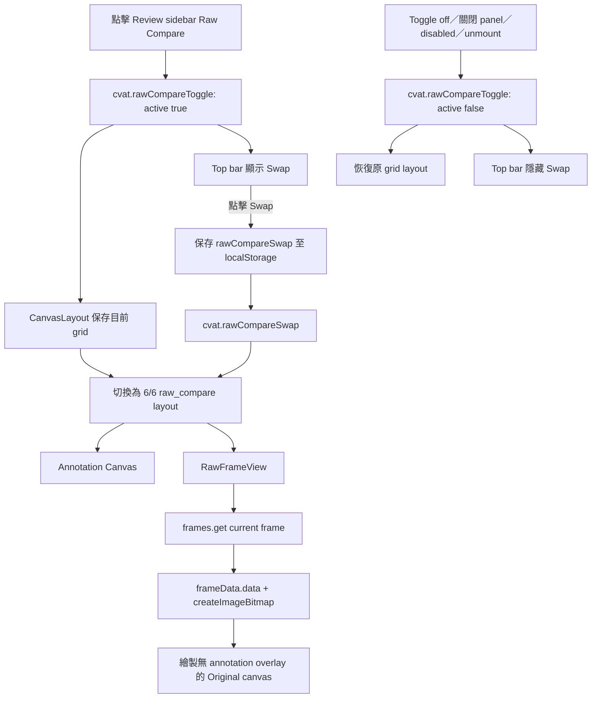

# 2. 在 Review Workspace 提供 Raw Compare 原始影像對照

#### Date:
`2026-02-23`

#### Status
`Accepted`

#### Related Ticket
[MSA-737](https://smartsurgerytek.atlassian.net/browse/MSA-737)

- [PR #12 — Review workflow enhancements](https://github.com/smartsurgerytek/sst-cvat/pull/12)
- [來源分支 — MSA-736-737-738-feature-batch](https://github.com/smartsurgerytek/sst-cvat/tree/MSA-736-737-738-feature-batch)

---

## Context

PR #12 同時包含 MSA-736、MSA-737 與 MSA-738；本 ADR 僅記錄 MSA-737 的 **Raw Compare**，不涵蓋 Finish Job、
Issue Mask，亦不涵蓋後續 MSA-739 Reviewer tablet branch 的觸控手勢與雙欄強化。

Review workspace 原本只顯示帶有 annotation overlays 的 Canvas，以及任務另行提供的 related/context images。
Reviewer 若要確認標註是否遮蔽、偏離或誤判影像內容，缺少一個可在相同 frame 中，同時觀看標註結果與無
annotation overlay 影像的入口。

我們需要保留既有 Review canvas 與 grid layout 行為，提供 2D Job 的並排人工視覺對照，且在離開比較模式後恢復
使用者原本的 grid 配置。此功能不進行 annotation diff、IoU 或 conflict 計算，也不修改任何 annotation 資料。

介面使用 **Original** 表示「由 CVAT frame API 提供、未疊加 annotations 的目前顯示影格」。它不保證是原始上傳檔案的無損位元內容，仍可能來自 CVAT 的壓縮或解碼流程。

---

## Decision

在 Review workspace 的左側 controls sidebar 新增 **Raw Compare** 眼睛圖示，並以既有 grid layout 建立
Annotation Canvas 與 Original frame 的雙欄檢視。

採用以下行為與架構：

1. Raw Compare 只支援 2D Job。非 2D Job 或目前 frame 已刪除時，控制顯示為 disabled，且不能啟用比較模式。
2. 點擊控制後，以 `cvat.rawCompareToggle` window `CustomEvent` 發送 `{ active: true | false }`，同步 sidebar、
   `CanvasLayout` 與 top bar。
3. `CanvasLayout` 使用 component-local `layoutMode` 管理 `grid` 與 `raw_compare`：
   - 啟用時先將目前 `layoutConfig` 保存於 ref；
   - 將 12 欄 grid 建立為兩個 6 × 12 panel；
   - 預設左側顯示既有 Annotation Canvas，右側顯示新的 `RawFrameView`；
   - 停用時恢復進入比較模式前的 grid layout。
4. 新增 `ViewType.RAW_FRAME` 與 `RawFrameView`。該 view 會依目前 `jobInstance` 與 `frameNumber`，使用既有
   `frames.get()`／`frameData.data()` 流程取得影像，經 `createImageBitmap()` 解碼後繪製到獨立 HTML canvas，
   不新增後端 API。
5. Original view 提供 loading、error 與 No data 狀態，並支援：
   - `0.5` 至 `3` 倍的游標中心 wheel zoom；
   - Pointer Events 拖曳平移；
   - **Reload layout**，重設雙欄配置、Original zoom 與 pan。
6. Raw Compare 啟用期間隱藏一般 grid 的 common setup controls，並在共用 top bar 顯示 **Swap** 按鈕。
7. 點擊 **Swap** 時：
   - 交換 Annotation Canvas 與 Original 的左右位置；
   - 以 `cvat.rawCompareSwap` event 通知 `CanvasLayout`；
   - 將偏好存入 `config.RAW_COMPARE_SWAP_STORAGE_KEY` 對應的 browser `localStorage` key `rawCompareSwap`。
8. 關閉眼睛控制、關閉 Original panel、切換為非 2D、frame 變為 deleted，或 Review control unmount 時，
   均會送出 `active: false`，讓其他元件退出比較狀態並隱藏 Swap。
9. 比較是否啟用、目前 layout 與進入比較前的 snapshot 都只存在 component state/ref；只有左右順序保存至 `localStorage`。
10. 不為 MSA-737 新增 backend endpoint、model、migration、schema、Redux action 或 reducer。跨元件協調採用
    UI-local state 與 window `CustomEvent`，避免將暫時性的 layout 狀態加入 domain store。

---

## Consequences

### Positive:

- Reviewer 可在同一個 frame 同時觀看 Annotation Canvas 與無 annotation overlay 的 Original view，不需切換頁面或暫時刪除／隱藏標註。
- 直接沿用既有 frame retrieval 與 grid layout，不需變更後端、資料模型或 annotation persistence flow。
- 關閉比較模式後可恢復原有的自訂 grid／context-image layout，減少工作區被永久重設的干擾。
- Swap 讓使用者選擇習慣的左右順序，且偏好可跨頁面重新載入保留。
- Original view 有獨立的 zoom、pan、reload 與錯誤狀態，可單獨檢查影像細節。

### Negative:

- 功能只支援 2D Job；3D Job 不提供 Raw Compare。
- 兩側的 zoom 與 pan 彼此獨立，無法保證像素位置同步或精確對齊；本功能是人工視覺對照，不是量化差異工具。
- **Original** 是 CVAT 提供的顯示影格，可能經過壓縮或解碼，不應被解讀成原始上傳檔案或鑑識等級的無損影像。
- 額外的 frame data 取得、ImageBitmap 與 canvas 會增加瀏覽器解碼、記憶體及繪製成本；大型影像與快速換 frame 的效能尚未量測。
- Frame load cleanup 只避免卸載後更新 React state，沒有中止已啟動的非同步載入；快速切換 frame 時仍存在較早載入稍晚完成與舊像素殘留的風險。
- `cvat.rawCompareToggle`、`cvat.rawCompareSwap` 與 `cvat.canvasLayoutAction` 是全域、字串化且沒有集中型別的
  事件契約，較難透過 Redux DevTools 追蹤，也依賴正確的 mount／cleanup 順序。
- `rawCompareSwapped` 同時存在於 top bar 與 `CanvasLayout`，以 event 和 `localStorage` 同步；若事件遺失或 storage 被外部修改，兩者可能短暫不一致。
- Swap 偏好是 browser-wide key，沒有依 user、organization、task 或 job 分區；比較啟用狀態與 grid snapshot 則完全不持久化。
- Sidebar toggle 是帶 click handler 的 icon，缺少原生 button semantics、明確 keyboard handler 與 `aria-label`；鍵盤及輔助科技操作仍需補強。
- 現有流程未提供 touch pinch zoom；平板與 S Pen／finger 行為屬於後續 MSA-739 範圍。

---

## Implementation Notes

| 責任 | 檔案 |
| --- | --- |
| Review sidebar 入口 | [`controls-side-bar.tsx`](../../../cvat-ui/src/components/annotation-page/review-workspace/controls-side-bar/controls-side-bar.tsx) |
| 2D/deleted guard、active 狀態與 toggle event | [`raw-frame-control.tsx`](../../../cvat-ui/src/components/annotation-page/review-workspace/controls-side-bar/raw-frame-control.tsx) |
| `RAW_FRAME` view type | [`canvas-layout.conf.tsx`](../../../cvat-ui/src/components/annotation-page/canvas/grid-layout/canvas-layout.conf.tsx) |
| 雙欄配置、layout snapshot／restore、Swap 與 panel lifecycle | [`canvas-layout.tsx`](../../../cvat-ui/src/components/annotation-page/canvas/grid-layout/canvas-layout.tsx) |
| Frame 載入、canvas render、zoom、pan 與狀態顯示 | [`raw-frame-view.tsx`](../../../cvat-ui/src/components/annotation-page/canvas/views/raw-frame/raw-frame-view.tsx) |
| Raw Frame panel 與 grid 樣式 | [`styles.scss`](../../../cvat-ui/src/components/annotation-page/canvas/grid-layout/styles.scss) |
| Raw Compare active listener 與 top-bar Swap | [`left-group.tsx`](../../../cvat-ui/src/components/annotation-page/top-bar/left-group.tsx) |
| `rawCompareSwap` storage key | [`config.tsx`](../../../cvat-ui/src/config.tsx) |
| Raw Compare Cypress spec | [`review_controls_raw_compare.js`](../../../tests/cypress/e2e/features2/review_controls_raw_compare.js) |

相關 Git 歷史：

- `29e07c303`：新增 Raw Frame view、Review toggle、2D split layout 與 Cypress spec。
- `a28b777b0`：保存並恢復進入比較前的 grid layout，並固定 Cypress viewport 為 1920 × 1080。
- `03cae0255`：新增 top-bar Swap 與左右順序的 `localStorage` 偏好。
- `5a4c44ae0`：移除 Original header 的 Fit views，保留 Reload layout。
- `0f327aff3`：集中 storage key，並改善 non-passive wheel listener 與游標中心縮放。
- `5d1e23f10`：PR #12 合併至 `sst-main`。

### Known Implementation Issue

本 ADR 撰寫時，來源分支與目前 `sst-main` 的 `canvas-layout.tsx` 仍包含：

```tsx
setLayoutConfig([...getLayout()]);
```

`getLayout()` 已在 `a28b777b0` 重構時移除，該 module 中沒有同名宣告或 import。Raw Compare 內的 Reload 走
`cvat.canvasLayoutAction`，不會執行這一行；但一般 grid 的 Reload button 仍引用此未定義函式。這可能使
TypeScript build 失敗，或在略過 type check 的輸出中造成 runtime error。

此 ADR 只記錄既存問題，沒有修正程式碼。完成修正與完整 UI／TypeScript build 前，不應宣稱此實作已通過 build acceptance。

### Validation Boundary

目前的 Raw Compare Cypress spec 只驗證：

- 在 Review workspace、1920 × 1080 viewport 中，控制存在且不是 disabled；
- 第一次點擊會加入 active class，並送出 `detail.active === true`；
- 第二次點擊會移除 active class，並送出 `detail.active === false`。

該 spec 只觀察 control 自己的 class 與 event；即使 `CanvasLayout` 沒有正確處理 event，測試仍可能通過。它
**尚未**驗證實際雙欄 layout、Original frame render、目前 frame 同步、layout restore、close／fullscreen、
Swap／localStorage、3D／deleted-frame guard、zoom／pan／reload、loading／error、frame race、權限、
accessibility 或響應式版面。

單獨執行現有 spec：

```bash
cd tests
yarn run cypress:run:chrome --spec cypress/e2e/features2/review_controls_raw_compare.js
```

本 ADR 撰寫期間未執行 Cypress 或完整 build；上述內容來自 PR、Git history 與程式碼靜態檢查。

---

## Alternatives Considered

- **在同一個 Canvas 暫時隱藏 annotations**：可以沿用完全相同的 viewport，但無法同時觀看兩個版本，來回切換也容易失去差異位置。
- **使用透明度 overlay／blending 疊合兩個版本**：有利於像素對齊，但標註與原圖會互相遮蔽，還需要額外的 opacity、同步 transform 與 rendering 設計。
- **以 modal 或獨立視窗顯示 Original**：實作邊界較獨立，但會中斷 Review workspace 的操作脈絡，也較難與目前 frame 及視窗尺寸保持同步。
- **使用 Redux 取代 window CustomEvent**：可提供集中、可追蹤且較有型別的狀態流，但會把短生命週期的
  UI layout state 擴大為全域 domain state，增加 action、reducer 與 cleanup 成本。
- **固定 Annotation／Original 的左右位置，不提供 Swap**：狀態更單純，但無法符合不同螢幕配置與使用習慣。

## Embedded Attachments

### Raw Compare Event and Rendering Flow

<div style="zoom:75%;">



</div>
