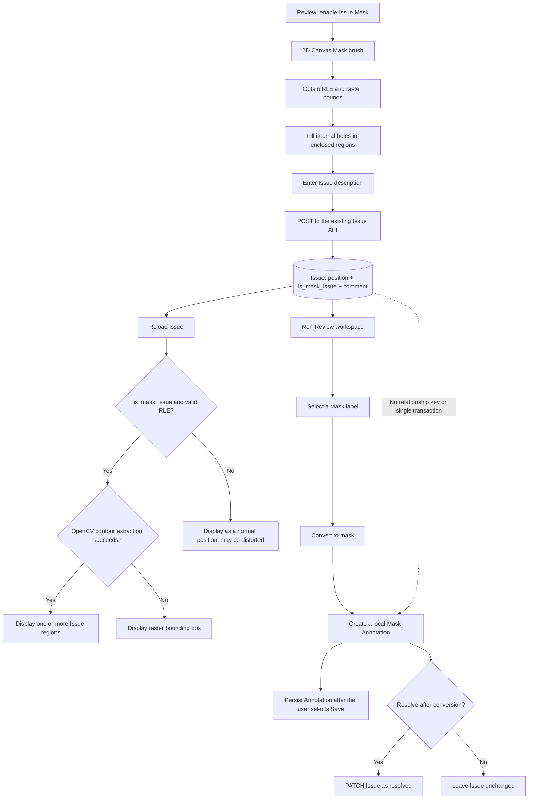

# 3. Use Issue Masks to Record and Convert Mask Problems in the Review Workspace

[繁體中文](README.md) | **English**

#### Date:
`2026-02-23`

#### Status
`Accepted`

#### Related Ticket
[MSA-738](https://smartsurgerytek.atlassian.net/browse/MSA-738)

- [PR #12 — Review workflow enhancements](https://github.com/smartsurgerytek/sst-cvat/pull/12)
- [Source branch — MSA-736-737-738-feature-batch](https://github.com/smartsurgerytek/sst-cvat/tree/MSA-736-737-738-feature-batch)

---

## Context

PR #12 includes MSA-736, MSA-737, and MSA-738. This ADR records only the **Issue Mask** work from MSA-738. It does not cover Finish Job, Raw Compare, or the touch/S Pen enhancements from the later MSA-739 Reviewer tablet branch.

Existing Review issues store coordinates in `Issue.position`, which are typically converted into a convex hull when an issue is created. This works for bounding-box or polygonal problem regions, but it cannot accurately preserve irregular, concave, or disconnected pixel regions. When a reviewer finds a localized problem in a mask annotation, they need to draw the exact region with a brush and leave an issue message. A user working outside the Review workspace can then select an appropriate mask label and create an editable annotation.

An Issue Mask is an **Issue**, not an annotation, when it is created. It must be stored, reloaded, and displayed through the existing Issue API. The system creates a separate Mask Annotation only after the user selects **Convert to mask**. The Issue and the annotation have different lifecycles, and the Issue is not bound to an annotation label in advance.

CVAT's existing mask points use RLE run lengths followed by `left, top, right, bottom` raster bounds at the end of the array. This feature must allow `Issue.position` to carry either the existing polygon coordinates or this RLE format while preserving the original semantics of legacy Issue data.

---

## Decision

Add an **Open an issue (mask)** tool to the left controls sidebar in the Review workspace. The tool reuses the 2D Canvas Mask brush to create the problem region, while the backend adds an `is_mask_issue` discriminator to the existing Issue contract.

Use the following behavior and architecture:

1. Add `is_mask_issue: boolean` to the existing `Issue` model, with a default value of `false`. The migration preserves the normal geometry semantics of existing Issues; it does not add a dedicated Issue Mask table or REST endpoint.
2. Keep `Issue.position` as a shared numeric array:
   - when `is_mask_issue !== true`, retain the coordinate semantics of a normal Issue;
   - when `is_mask_issue === true`, the frontend interprets it as RLE runs followed by raster bounds.
3. Expose this field through the read, create, and partial-update serializers, the OpenAPI schema, and the `Issue` class in `cvat-core`. New Issue Masks continue to use the existing `/api/issues` endpoint and `jobInstance.openIssue()` for persistence.
4. Support the Issue Mask control only for 2D Jobs. It is disabled for a non-2D Job or when the current frame has been deleted. The user can click the icon or use the `m` shortcut to start or finish drawing.
5. Reuse the existing Mask brush, eraser, and polygon brush tools while drawing, but hide the annotation-specific label, remove-underlying, and hide-mask controls. The Canvas wrapper does not treat this drawing operation as annotation creation.
6. After receiving `canvas.drawn`, preserve the complete RLE instead of converting it into a convex hull. If the RLE forms an enclosed region, fill its internal holes with a flood fill that starts at the image boundary, then initiate the Issue creation flow with `NewIssueSource.ISSUE_MASK`.
7. Require a description in the Create Issue dialog, and allow label names from the current Job to be inserted as text at the cursor position. The label text only assists with composing the Issue message; it does not determine the label of the annotation created later.
8. In `finishIssueAsync`, create a core Issue with `is_mask_issue: true` and write the RLE position and first comment through the existing Issue API. Normal Issues continue to use the original hull flow.
9. To display a stored Issue Mask, first validate its format with the shared `isLikelyRle()`, then use OpenCV to extract one or more contours from the mask so that disconnected regions appear under the same Issue ID. If contour extraction fails, log an internal error and fall back to the raster bounding box.
10. Offer **Convert to mask** only outside the Review workspace and when `issue.isMaskIssue === true`. Both the Canvas Issue dialog and the Standard workspace Issues sidebar provide an entry point. The user must select a target label compatible with Mask annotations (`mask` or `any`).
11. During conversion, reuse a valid Issue RLE when available. Otherwise, attempt to interpret the position as a polygon and rasterize it into RLE, then add a Mask Annotation to the current annotation session through the existing `createAnnotationsAsync`. The user must still perform the existing **Save** action to persist the annotation.
12. Allow the user to resolve the Issue after conversion. Annotation creation and Issue resolution are two sequential operations; no Issue-to-Annotation relationship, cross-operation transaction, or duplicate-conversion protection is added.

The backend migration, serializers, schema, core, and UI must be deployed together. If the new UI connects to an old backend first, `is_mask_issue` may be ignored, causing the RLE position to lose its reliable geometry discriminator.

---

## Consequences

### Positive:

- Reviewers can use the familiar Mask brush to identify concave, multi-region, or pixel-level problems precisely instead of being constrained by a convex hull.
- RLE can preserve the existing Canvas mask result directly and reconstruct multiple contours after reload without introducing image or attachment storage.
- Because `is_mask_issue` defaults to `false`, existing Issues retain their original coordinate interpretation, making this an additive data-model change.
- The feature reuses existing Issue permissions, comments, resolve/reopen behavior, and annotation-creation flows without adding a REST endpoint.
- Keeping Issues separate from annotations allows the Review stage to record a problem and its discussion first, then lets another user select the correct mask label later.
- The UI displays a warning or error when no compatible Mask label exists or when RLE conversion or annotation creation fails; unexpected exceptions are written to the existing logger.

### Negative:

- `Issue.position` carries both polygon coordinates and RLE, so its data semantics depend entirely on `is_mask_issue`. The backend currently validates only that it is a non-empty numeric array; it does not validate the RLE structure or consistency with the flag, and both values can be PATCHed. Inconsistent data may be drawn or converted incorrectly.
- The Issue API does not support an `is_mask_issue` query filter. Clients must retrieve Issues first and then determine their types.
- The RLE payload, frontend decoding, and OpenCV contour extraction increase network, CPU, and memory costs. Limits for large or complex masks have not been measured.
- Flood fill fills background regions that are not connected to the raster boundary. This can turn a closed stroke into a solid region, but it may also remove holes that the user intentionally preserved.
- The invalid-RLE fallback attempts to interpret the same numeric array as polygon coordinates. Without a server-side invariant, this may produce meaningless geometry.
- Conversion only adds the Mask Annotation to the current annotation session. The Issue can be resolved before the annotation is saved. Closing the browser, a failed Save, or a failed resolve can therefore leave the two sides in inconsistent states.
- The Issue and the new Annotation have no relationship ID or converted marker. The same Issue can be converted repeatedly, producing duplicate mask annotations.
- The Canvas Issue dialog and Issues sidebar each implement polygon-to-RLE conversion, label selection, conversion, and optional resolution. A future fix may be applied to only one entry point.
- The primary gate for creation and conversion is the workspace rather than a hard job-stage condition. If another navigation path allows the corresponding workspace to be entered at an unexpected stage, the tool may still appear.
- The feature supports only 2D. The behavior of 3D, touch, and S Pen is outside this decision's validation scope. The sidebar control is an icon with a click handler rather than native button semantics and lacks an explicit `aria-label`; keyboard focus and screen-reader behavior still require validation.

---

## Implementation Notes

| Responsibility | File |
| --- | --- |
| Define the `OPEN_ISSUE_MASK` control and `ISSUE_MASK` source | [`reducers/index.ts`](../../../cvat-ui/src/reducers/index.ts) |
| Mount the Issue Mask control in the Review sidebar | [`controls-side-bar.tsx`](../../../cvat-ui/src/components/annotation-page/review-workspace/controls-side-bar/controls-side-bar.tsx) |
| 2D/deleted-frame guard, shortcut, Mask drawing, and hole filling | [`issue-mask-control.tsx`](../../../cvat-ui/src/components/annotation-page/review-workspace/controls-side-bar/issue-mask-control.tsx) |
| Issue Mask-specific brush toolbox | [`brush-tools.tsx`](../../../cvat-ui/src/components/annotation-page/canvas/views/canvas2d/brush-tools.tsx) |
| Prevent Mask Issue drawings from creating normal annotations | [`canvas-wrapper.tsx`](../../../cvat-ui/src/components/annotation-page/canvas/views/canvas2d/canvas-wrapper.tsx) |
| Issue source, RLE preservation, API creation, and error actions | [`review-actions.ts`](../../../cvat-ui/src/actions/review-actions.ts) |
| New Issue position/source lifecycle | [`review-reducer.ts`](../../../cvat-ui/src/reducers/review-reducer.ts) |
| Issue description and label-text picker | [`create-issue-dialog.tsx`](../../../cvat-ui/src/components/annotation-page/review/create-issue-dialog.tsx) |
| RLE validation, OpenCV contours, and Issue region aggregation | [`issues-aggregator.tsx`](../../../cvat-ui/src/components/annotation-page/review/issues-aggregator.tsx), [`utils/masks.ts`](../../../cvat-ui/src/utils/masks.ts), [`opencv-wrapper.ts`](../../../cvat-ui/src/utils/opencv-wrapper/opencv-wrapper.ts) |
| Multi-contour Issue region types and SVG group rendering | [`canvas.ts`](../../../cvat-canvas/src/typescript/canvas.ts), [`canvasController.ts`](../../../cvat-canvas/src/typescript/canvasController.ts), [`canvasModel.ts`](../../../cvat-canvas/src/typescript/canvasModel.ts), [`canvasView.ts`](../../../cvat-canvas/src/typescript/canvasView.ts) |
| Convert to mask in the Canvas dialog | [`issue-dialog.tsx`](../../../cvat-ui/src/components/annotation-page/review/issue-dialog.tsx) |
| Convert to mask/resolve/reopen in the Standard sidebar | [`issues-list.tsx`](../../../cvat-ui/src/components/annotation-page/standard-workspace/objects-side-bar/issues-list.tsx) |
| Create a local Annotation ObjectState and report failures | [`annotation-actions.ts`](../../../cvat-ui/src/actions/annotation-actions.ts) |
| Core Issue wire contract | [`cvat-core/src/issue.ts`](../../../cvat-core/src/issue.ts) |
| Issue model, migration, and serializers | [`models.py`](../../../cvat/apps/engine/models.py), [`0096_issue_is_mask_issue.py`](../../../cvat/apps/engine/migrations/0096_issue_is_mask_issue.py), [`serializers.py`](../../../cvat/apps/engine/serializers.py) |
| OpenAPI Issue read/write/PATCH schema | [`schema.yml`](../../../cvat/schema.yml) |
| Issue Mask Cypress spec | [`review_controls_issue_mask.js`](../../../tests/cypress/e2e/features2/review_controls_issue_mask.js) |

Relevant Git history:

- `29e07c303`: added the Issue Mask brush, `is_mask_issue` model/API/core contract, conversion entry points, and Cypress spec.
- `a28b777b0`: restructured the two-stage Validation/Annotation Cypress flow and fixed the viewport at 1920 × 1080.
- `b08d905c0`: improved workspace switching and the control icon and brush toolbox lifecycles.
- `cacf8c71a`: aligned the Issue UI with the Validation/Annotation stages and strengthened resolve/reopen display behavior.
- `a7166c3b2`: preserved RLE, supported multi-contour display, filled enclosed regions, and restructured the conversion test flow.
- `a66620614`, `2bd33298a`: added the label-text picker and insertion at the cursor position.
- `cae64938c`: added **Convert to mask** to the Canvas Issue dialog.
- `0f327aff3`: centralized `isLikelyRle()` and added conversion notifications, logging, and error handling.
- `5d1e23f10`: merged PR #12 into `sst-main`.

### Known Implementation Issues

- The `resolve` prop in the Canvas Issue dialog returns `void` and only dispatches the asynchronous `resolveIssueAsync`. The conversion flow invokes it inside a synchronous `try/catch`, so it cannot await or catch a failed resolve PATCH. As a result, the expected **Mask created, issue not resolved** warning is unreliable through this entry point. The direct flow in the Issues sidebar does `await` the resolve operation.
- The API does not validate the invariant between `is_mask_issue` and the RLE position and allows each value to be PATCHed independently. Until a server-side validator or typed geometry contract is introduced, data-repair tools and third-party API clients must maintain the flag and position together.
- PR #12 changed the API metadata version in `cvat/schema.yml` from the base version `2.55.1` to `2.54.1`, while `cvat-ui/package.json` remains at `2.55.1`. This is not part of the Issue Mask decision and should still be corrected before release to avoid API documentation version drift.

This ADR only records the existing issues above; it does not modify feature code.

### Validation Boundary

The current Issue Mask Cypress spec contains a Validation stage and an Annotation stage. Based on static code inspection, it verifies that:

- a 2D image task with two Mask labels is created and Review is opened at a 1920 × 1080 viewport;
- when the UI control exists, its enabled/active classes and brush toolbox are checked, two disconnected strokes are drawn, and a second click completes drawing;
- the Issue POST returns `201`, and its request and response contain `is_mask_issue: true`, an RLE-like position, and the expected message;
- resolving hides the Issue region, reopening displays it again, and the same SVG Issue group contains at least two polygons;
- conversion through either the Canvas dialog or the Issues sidebar outside the Review workspace creates one Mask object, whose label is changed and which remains present as one Mask object after Save and reload.

The spec has the following important limitations:

- If `.cvat-issue-mask-control` does not exist, the test falls back to a direct POST to `/api/issues`. The test may therefore pass even when the control is missing or the drawing flow is broken.
- The label-text selector assertion is conditional. If Canvas dialog conversion is unavailable, the test also falls back to the sidebar, so it cannot independently guarantee that each entry point exists and works.
- The spec completes drawing by clicking the control again and does not verify the `m` shortcut. It also does not create a normal Issue to confirm that **Convert to mask** does not appear for it.
- After reload, it verifies only the number of Mask objects, not the exact changed label, RLE/pixel geometry, or area.
- Invalid RLE, OpenCV/API/Save/resolve failures, retries, the absence of a Mask label, resolve-after-convert, duplicate conversion, the 3D/deleted-frame guard, permissions, read-only mode, accessibility, responsiveness, touch, S Pen, and large-mask performance are not covered.
- No backend serializer or migration unit test was added.

Run the existing spec by itself with:

```bash
cd tests
yarn run cypress:run:chrome --spec cypress/e2e/features2/review_controls_issue_mask.js
```

Cypress, backend tests, and a complete build were not run while writing this ADR. The results above come from the PR, Git history, and static code inspection.

---

## Alternatives Considered

- **Continue using normal Issue polygons/convex hulls**: requires no data-model change, but expands concave regions and merges disconnected regions, so it cannot preserve the pixel area drawn by the reviewer.
- **Create a Mask Annotation directly during Review**: gives the data a label and annotation lifecycle immediately, but combines “reporting a problem” and “correcting the annotation” into one operation and makes it harder to preserve an independent Issue discussion/resolve workflow.
- **Add a separate IssueMask model or typed geometry union**: could provide strong backend typing and an RLE validator, preventing inconsistencies between the flag and position; the cost is additional tables, serializers, APIs, and compatibility migrations.
- **Convert RLE to contours and then store polygons**: would make reads more consistent with normal Issues, but conversion may be lossy, payload size would be unpredictable, and the original mask raster semantics would be lost.
- **Add a server-side Convert Issue to Mask transaction API**: could atomically create the annotation, establish a relationship, and resolve the Issue while also providing idempotency. However, it would require a new domain model, permissions, rollback behavior, and API contract, which exceeds the scope of this frontend-oriented requirement.

## Embedded Attachments

### Issue Mask Creation, Rendering, and Conversion Flow

<div style="zoom:75%;">



</div>
