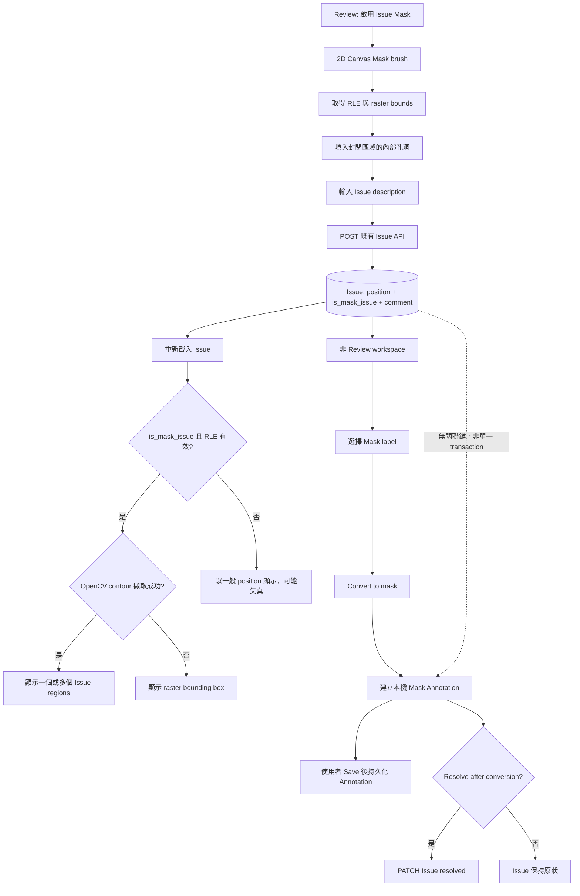

# 3. 在 Review Workspace 以 Issue Mask 記錄並轉換遮罩問題

#### Date:
`2026-02-23`

#### Status
`Accepted`

#### Related Ticket
[MSA-738](https://smartsurgerytek.atlassian.net/browse/MSA-738)

- [PR #12 — Review workflow enhancements](https://github.com/smartsurgerytek/sst-cvat/pull/12)
- [來源分支 — MSA-736-737-738-feature-batch](https://github.com/smartsurgerytek/sst-cvat/tree/MSA-736-737-738-feature-batch)

---

## Context

PR #12 同時包含 MSA-736、MSA-737 與 MSA-738；本 ADR 僅記錄 MSA-738 的 **Issue Mask**，
不涵蓋 Finish Job、Raw Compare，亦不涵蓋後續 MSA-739 Reviewer tablet branch 的 touch／S Pen 強化。

既有 Review issue 以 `Issue.position` 儲存座標，建立時通常會轉成 convex hull。
這適合框選或多邊形問題區域，但無法準確保留不規則、凹形或彼此分離的像素區域。
Reviewer 若發現 mask annotation 的局部問題，需要先以 brush 描繪精確區域、留下 issue 訊息，
之後再由非 Review workspace 的處理者選擇合適的 mask label，建立可編輯的 annotation。

Issue Mask 在建立時是 **Issue**，不是 annotation。它需要經既有 Issue API 儲存、重新載入及顯示；
選擇 **Convert to mask** 後，系統才會另外建立一筆 Mask Annotation。
兩者具有不同的生命週期，且 Issue 本身不預先綁定 annotation label。

CVAT 既有 mask points 採用 RLE run lengths，並在陣列末端附上 `left, top, right, bottom` raster bounds。
本功能需要讓 `Issue.position` 同時能承載既有 polygon coordinates 或此 RLE 格式，
又要讓舊 Issue 資料維持原有語意。

---

## Decision

在 Review workspace 的左側 controls sidebar 新增 **Open an issue (mask)** 工具，
重用 2D Canvas 的 Mask brush 建立問題區域；後端則在既有 Issue contract 加入 `is_mask_issue` 判別欄位。

採用以下行為與架構：

1. 在既有 `Issue` model 新增 `is_mask_issue: boolean`，預設為 `false`。
   Migration 會讓既有 Issue 保持一般 geometry 語意；不新增 Issue Mask 專用資料表或 REST endpoint。
2. `Issue.position` 維持共用的數字陣列：
   - `is_mask_issue !== true` 時，沿用一般 Issue 的座標語意；
   - `is_mask_issue === true` 時，前端將其解讀為 RLE runs 加 raster bounds。
3. Read、create 與 partial-update serializers、OpenAPI schema 及 `cvat-core` 的 `Issue` class 都公開此欄位；
   新 Issue Mask 仍透過既有 `/api/issues` 與 `jobInstance.openIssue()` 儲存。
4. Issue Mask control 只支援 2D Job；非 2D Job 或目前 frame 已刪除時顯示為 disabled。使用者可點擊圖示或使用 `m` shortcut 開始／結束繪製。
5. 繪製時沿用既有 Mask brush、eraser 與 polygon brush tools，
   但隱藏 annotation-specific label、remove-underlying 與 hide-mask controls。
   Canvas wrapper 不把本次繪製當成 annotation 建立。
6. 收到 `canvas.drawn` 後，前端保留完整 RLE，不再轉成 convex hull。
   若 RLE 形成封閉區域，會以由影像邊界開始的 flood fill 填入內部孔洞，
   再以 `NewIssueSource.ISSUE_MASK` 啟動建立 Issue 流程。
7. Create Issue dialog 要求輸入 description，並可從目前 Job 的 label names 選擇文字插入游標位置。
   Label text 只協助填寫 issue message，不會決定之後轉換出的 annotation label。
8. `finishIssueAsync` 建立 `is_mask_issue: true` 的 core Issue，
   將 RLE position 與第一則 comment 寫入既有 Issue API；一般 Issue 仍沿用原本的 hull 流程。
9. 顯示已儲存的 Issue Mask 時，前端先以共用 `isLikelyRle()` 檢查格式，
   再使用 OpenCV 從 mask 擷取一個或多個 contours，讓 disconnected regions 以同一個 Issue ID 呈現。
   Contour 擷取失敗時記錄內部錯誤並退回 raster bounding box。
10. 只有非 Review workspace 且 `issue.isMaskIssue === true` 時提供 **Convert to mask**。
    Canvas issue dialog 與 Standard workspace Issues sidebar 都提供入口；
    使用者必須從與 Mask 相容的 labels（`mask` 或 `any`）選擇目標 label。
11. 轉換時優先沿用有效的 Issue RLE，否則嘗試把 position 視為 polygon rasterize 成 RLE，
    再以既有 `createAnnotationsAsync` 將 Mask Annotation 加入目前 annotation session。
    使用者仍須執行既有 **Save** 才能將 annotation 持久化。
12. 使用者可選擇在轉換後 resolve Issue；annotation 建立與 Issue resolve 是兩個循序操作，
    不建立 Issue-to-Annotation 關聯，也不提供跨兩者的 transaction 或重複轉換防護。

Backend migration、serializer、schema、core 與 UI 必須同版部署。
若新版 UI 先連到舊 backend，`is_mask_issue` 可能被忽略，
RLE position 便會失去可靠的 geometry discriminator。

---

## Consequences

### Positive:

- Reviewer 可用熟悉的 Mask brush 精確標示凹形、多區塊或像素級問題，不再受 convex hull 範圍限制。
- RLE 可直接保存既有 Canvas mask 結果，並在重新載入後重建多個 contours，不需新增影像或附件儲存機制。
- `is_mask_issue` 預設為 `false`，既有 Issue 仍維持原本的座標解讀，屬於加法式資料模型變更。
- 沿用既有 Issue 權限、comment、resolve／reopen 與 annotation 建立流程，沒有新增 REST endpoint。
- Issue 與 annotation 分離，使 Review 階段可以先記錄問題及討論內容，之後再由處理者選擇正確的 mask label。
- 無可用 Mask label、RLE 轉換或 annotation 建立失敗時，UI 會提供 warning／error，非預期例外會寫入既有 logger。

### Negative:

- `Issue.position` 同時承載 polygon coordinates 與 RLE，資料語意完全依賴 `is_mask_issue`。
  後端目前只驗證非空數字陣列，不驗證 RLE 結構或旗標一致性，而且兩者皆可被 PATCH；
  不一致資料可能被錯誤繪製或轉換。
- Issue API 不支援依 `is_mask_issue` query filter；需要先取得 Issues 再由 client 判斷類型。
- RLE payload、前端解碼及 OpenCV contour extraction 會增加網路、CPU 與記憶體成本；大型或複雜 mask 的上限尚未量測。
- Flood fill 會填滿未與 raster 邊界連通的背景。這可把封閉筆劃轉成實心區域，但也可能移除使用者刻意保留的孔洞。
- Invalid RLE 的 fallback 會嘗試把同一數字陣列視為 polygon coordinates；在缺少 server-side invariant 的情況下，可能產生無意義的 geometry。
- 轉換只把 Mask Annotation 加入目前 annotation session；Issue 可在 annotation 尚未 Save 前就被 resolve。
  瀏覽器關閉、Save 失敗或 resolve 失敗都可能留下兩邊狀態不一致。
- Issue 與新 Annotation 沒有關聯 ID 或 converted marker；同一 Issue 可重複轉換，形成重複 mask annotations。
- Canvas issue dialog 與 Issues sidebar 各自實作 polygon-to-RLE、label selection、conversion 及 optional resolve，
  未來修正可能只套用到其中一個入口。
- 建立與轉換的主要 gating 是 workspace，而不是 job stage 的硬性條件；若其他導覽路徑允許以非預期 stage 進入相應 workspace，工具仍可能出現。
- 功能只支援 2D；3D、touch 與 S Pen 行為不在本次決策的驗證範圍。
  Sidebar control 是帶 click handler 的 icon，缺少原生 button semantics 與明確 `aria-label`，
  keyboard focus 與 screen reader 仍需驗證。

---

## Implementation Notes

| 責任 | 檔案 |
| --- | --- |
| `OPEN_ISSUE_MASK` control 與 `ISSUE_MASK` source 定義 | [`reducers/index.ts`](../../../cvat-ui/src/reducers/index.ts) |
| Review sidebar 掛載 Issue Mask control | [`controls-side-bar.tsx`](../../../cvat-ui/src/components/annotation-page/review-workspace/controls-side-bar/controls-side-bar.tsx) |
| 2D/deleted guard、shortcut、Mask drawing 與 hole fill | [`issue-mask-control.tsx`](../../../cvat-ui/src/components/annotation-page/review-workspace/controls-side-bar/issue-mask-control.tsx) |
| Issue Mask 專用 brush toolbox | [`brush-tools.tsx`](../../../cvat-ui/src/components/annotation-page/canvas/views/canvas2d/brush-tools.tsx) |
| 阻止 Mask issue drawing 建立一般 annotation | [`canvas-wrapper.tsx`](../../../cvat-ui/src/components/annotation-page/canvas/views/canvas2d/canvas-wrapper.tsx) |
| Issue source、RLE 保留、API 建立與錯誤 action | [`review-actions.ts`](../../../cvat-ui/src/actions/review-actions.ts) |
| 新 Issue position／source lifecycle | [`review-reducer.ts`](../../../cvat-ui/src/reducers/review-reducer.ts) |
| Issue description 與 label-text picker | [`create-issue-dialog.tsx`](../../../cvat-ui/src/components/annotation-page/review/create-issue-dialog.tsx) |
| RLE 驗證、OpenCV contours 與 Issue region aggregation | [`issues-aggregator.tsx`](../../../cvat-ui/src/components/annotation-page/review/issues-aggregator.tsx), [`utils/masks.ts`](../../../cvat-ui/src/utils/masks.ts), [`opencv-wrapper.ts`](../../../cvat-ui/src/utils/opencv-wrapper/opencv-wrapper.ts) |
| 多 contour Issue region 型別與 SVG group rendering | [`canvas.ts`](../../../cvat-canvas/src/typescript/canvas.ts), [`canvasController.ts`](../../../cvat-canvas/src/typescript/canvasController.ts), [`canvasModel.ts`](../../../cvat-canvas/src/typescript/canvasModel.ts), [`canvasView.ts`](../../../cvat-canvas/src/typescript/canvasView.ts) |
| Canvas dialog 的 Convert to mask | [`issue-dialog.tsx`](../../../cvat-ui/src/components/annotation-page/review/issue-dialog.tsx) |
| Standard sidebar 的 Convert to mask／resolve／reopen | [`issues-list.tsx`](../../../cvat-ui/src/components/annotation-page/standard-workspace/objects-side-bar/issues-list.tsx) |
| 建立本機 Annotation ObjectState 與失敗回報 | [`annotation-actions.ts`](../../../cvat-ui/src/actions/annotation-actions.ts) |
| Core Issue wire contract | [`cvat-core/src/issue.ts`](../../../cvat-core/src/issue.ts) |
| Issue model、migration 與 serializers | [`models.py`](../../../cvat/apps/engine/models.py), [`0096_issue_is_mask_issue.py`](../../../cvat/apps/engine/migrations/0096_issue_is_mask_issue.py), [`serializers.py`](../../../cvat/apps/engine/serializers.py) |
| OpenAPI Issue read／write／PATCH schema | [`schema.yml`](../../../cvat/schema.yml) |
| Issue Mask Cypress spec | [`review_controls_issue_mask.js`](../../../tests/cypress/e2e/features2/review_controls_issue_mask.js) |

相關 Git 歷史：

- `29e07c303`：新增 Issue Mask brush、`is_mask_issue` model／API／core contract、轉換入口與 Cypress spec。
- `a28b777b0`：重整 validation／annotation 兩階段 Cypress flow，並固定 viewport 為 1920 × 1080。
- `b08d905c0`：改善 workspace switch、control icon 與 brush toolbox lifecycle。
- `cacf8c71a`：讓 issue UI 配合 Validation／Annotation stage，並補強 resolve／reopen 顯示。
- `a7166c3b2`：保留 RLE、支援 multi-contour 顯示、填入封閉區域，並重整 conversion 測試流程。
- `a66620614`、`2bd33298a`：新增 label-text picker 與游標位置插入。
- `cae64938c`：在 Canvas issue dialog 新增 **Convert to mask**。
- `0f327aff3`：集中 `isLikelyRle()`，補上 conversion notification、logging 與錯誤處理。
- `5d1e23f10`：PR #12 合併至 `sst-main`。

### Known Implementation Issues

- Canvas issue dialog 的 `resolve` prop 回傳 `void`，只 dispatch 非同步 `resolveIssueAsync`。
  轉換流程用同步 `try/catch` 呼叫它，因此無法等待或捕捉 resolve PATCH 失敗，
  預期的 **Mask created, issue not resolved** warning 在此入口不可靠；
  Issues sidebar 的 direct flow 則會 `await` resolve。
- API 沒有驗證 `is_mask_issue` 與 RLE position 的不變條件，也允許獨立 PATCH 兩者。
  建立 server-side validator 或 typed geometry contract 前，
  資料修復與第三方 API client 都必須同時維護旗標及 position。
- PR #12 將 `cvat/schema.yml` 的 API metadata version 從 base 的 `2.55.1` 變為 `2.54.1`，
  但 `cvat-ui/package.json` 仍為 `2.55.1`。這不是 Issue Mask 決策的一部分，
  仍應在發布前校正以避免 API 文件版本漂移。

本 ADR 只記錄上述既存問題，沒有修改功能程式碼。

### Validation Boundary

目前的 Issue Mask Cypress spec 包含 Validation 與 Annotation 兩段流程。依程式碼靜態檢查，它會驗證：

- 建立具有兩個 Mask labels 的 2D image task，並在 1920 × 1080 viewport 進入 Review；
- UI control 存在時，檢查 enabled／active class、brush toolbox，繪製兩個 disconnected strokes，並以第二次點擊完成繪製；
- Issue POST 回傳 `201`，request／response 具有 `is_mask_issue: true`、RLE-like position 與預期 message；
- resolve 後隱藏 issue region、reopen 後重新顯示，且同一 SVG issue group 至少包含兩個 polygons；
- 在非 Review workspace 透過 Canvas dialog 或 Issues sidebar 轉換後產生一個 Mask object，變更 label、Save 並 reload 後仍存在一個 Mask object。

該 spec 有以下重要限制：

- 若 `.cvat-issue-mask-control` 不存在，測試會改用直接 POST `/api/issues` 的 fallback，因此 control 缺失或繪製流程損壞時仍可能通過。
- Label-text selector 的檢查是條件式；Canvas dialog conversion 不存在時也會改走 sidebar，因此無法單獨保證各入口存在且正常。
- Spec 以再次點擊 control 完成繪製，沒有驗證 `m` shortcut；也沒有建立一般 Issue 來確認其不會顯示 **Convert to mask**。
- Reload 後只確認 Mask object 數量，沒有斷言變更後的確切 label、RLE／pixel geometry 或 area。
- 尚未覆蓋 invalid RLE、OpenCV／API／Save／resolve failure、重試、無 Mask label、resolve-after-convert、
  重複轉換、3D／deleted-frame guard、權限、唯讀模式、accessibility、responsive、touch、S Pen 或大型 mask 效能。
- 沒有新增後端 serializer／migration unit test。

單獨執行現有 spec：

```bash
cd tests
yarn run cypress:run:chrome --spec cypress/e2e/features2/review_controls_issue_mask.js
```

本 ADR 撰寫期間未執行 Cypress、後端測試或完整 build；上述結果來自 PR、Git history 與程式碼靜態檢查。

---

## Alternatives Considered

- **沿用一般 Issue 的 polygon／convex hull**：不需資料模型變更，但會擴張凹形區域並合併 disconnected regions，無法保留 reviewer 畫出的像素範圍。
- **Review 時直接建立 Mask Annotation**：資料立即具有 label 與 annotation lifecycle，
  但會把「指出問題」與「修正標註」混成同一操作，也不利於保留獨立的 issue discussion／resolve workflow。
- **新增獨立 IssueMask model 或 typed geometry union**：可在後端建立強型別與 RLE validator，
  避免旗標和 position 不一致；代價是更多 table、serializer、API 與相容性遷移。
- **把 RLE 轉成 contours 後再儲存 polygons**：讀取與一般 Issue 較一致，但轉換可能失真、資料量不可預測，也會失去原始 mask raster 語意。
- **新增 server-side Convert Issue to Mask transaction API**：可原子地建立 annotation、建立關聯並 resolve Issue，
  也能提供 idempotency；但需要新的 domain model、權限、rollback 與 API contract，超出本次前端導向需求。

## Embedded Attachments

### Issue Mask Creation, Rendering and Conversion Flow

<div style="zoom:75%;">



</div>
