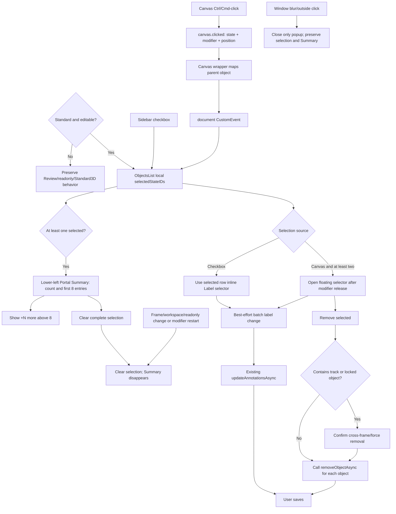

# 4. Provide Object Multi-Selection, Batch Operations, and a Selected Objects Summary in the Standard Workspace

[繁體中文](README.md) | **English**

#### Date:
`2026-05-14` (MSA-742); Amended `2026-05-28` (MSA-896)

#### Status
`Accepted`

#### Related Ticket

- [MSA-742](https://smartsurgerytek.atlassian.net/browse/MSA-742)
- [MSA-896](https://smartsurgerytek.atlassian.net/browse/MSA-896)

#### Related Pull Requests and Branches

- [PR #17 — MSA-742 select change label](https://github.com/smartsurgerytek/sst-cvat/pull/17)
- [PR #19 — Show selected objects summary](https://github.com/smartsurgerytek/sst-cvat/pull/19)
- [PR #20 — Selection summary review follow-up](https://github.com/smartsurgerytek/sst-cvat/pull/20)
- [Source branch — MSA-742-select-change-label](https://github.com/smartsurgerytek/sst-cvat/tree/MSA-742-select-change-label)
- [Source branch — MSA-896-select-list](https://github.com/smartsurgerytek/sst-cvat/tree/MSA-896-select-list)

---

## Context

This ADR treats PR #17, PR #19, and PR #20 as the evolution of a single multi-object operation feature in the Standard annotation workspace: PR #17 introduced checkbox/Canvas multi-selection, batch Label changes, and bulk removal; PR #19 added a **Selected Objects Summary** backed by the same selection state; and PR #20 supplied the naming, structure, and responsive style fixes that had been completed after the PR #19 review but were not pushed. PR #17 was merged on 2026-05-14, and the MSA-896 extension was fully merged on 2026-05-28.

Before this change, the Label selector in the Objects sidebar primarily operated on one object, and Canvas clicks and the sidebar did not share a batch selection. Users who wanted to change several objects to the same label had to operate on them one at a time. When locating objects on the Canvas, users also lacked a multi-selection state synchronized back to the sidebar and a centralized action entry point.

We need to support two workflows at the same time: selecting objects precisely through sidebar checkboxes, and clicking objects directly on the Canvas while holding Ctrl on Windows/Linux or Command on macOS. Both entry points must use the same set of selected object IDs, while avoiding interruptions from a floating popup for checkbox users and preserving existing behavior in Review, readonly mode, and other workspaces. Once objects are selected, users also need a summary independent of the sidebar scroll position so that they can verify the selection count, object ID, label, and type before acting.

Label changes and removal remain existing CVAT annotation session operations; none of the three PRs adds a server-side bulk endpoint. The Selected Objects Summary is also a read-only UI projection and does not create a second selection state. After completing a batch operation, the user must still use the existing **Save** action to persist annotation changes to the backend.

---

## Decision

Add checkbox-based multi-selection to the editable `Workspace.STANDARD` Objects sidebar, and bridge Canvas Ctrl/Cmd-click events into the same component-local selection state.

Adopt the following behavior and architecture:

1. Multi-selection is enabled only when `workspace === Workspace.STANDARD && !readonly`. Review, Standard 3D, other workspaces, and readonly mode do not show checkboxes or execute batch operations.
2. `ObjectsListContainer` stores the `selectedStateIDs` and floating selector state for the current frame/workspace in local React state. The temporary selection is not added to Redux and is not persisted across pages.
3. Every object row in the sidebar displays a checkbox. A selected row receives a multi-selected class and dashed outline. The checkbox and the row Label selector stop mouse event propagation so that they do not also activate the row.
4. The checkbox flow does not show the floating selector:
   - Choosing a new label from the inline Label selector of any selected row changes the label for the entire selection;
   - Changing the label of an unselected row updates only that row and preserves the existing multi-selection.
5. The Canvas flow passes through the following events in order:
   - `canvas.clicked` from `cvat-canvas` includes the object state, `ctrlKey`, `metaKey`, and client coordinates;
   - The Canvas wrapper maps a skeleton element to its parent object and dispatches a `cvat.objects.sidebar.toggle-multi-selection` document `CustomEvent` in the Standard workspace;
   - The Objects sidebar validates the payload and toggles the same `selectedStateIDs` by object `clientID`.
6. During consecutive Canvas Ctrl/Cmd-clicks, the last object and cursor position are held temporarily. The floating Label selector opens near the final click only after the modifier key is released and at least two objects are selected; its position is clamped to the viewport bounds.
7. The floating selector obtains its candidate labels from one compatible selected source object. If the last click targets a skeleton, it searches backward for another selected object whose label can be changed. The selector is not shown when no compatible source exists.
8. Batch label changes are best-effort: each object is checked to ensure that it is not a skeleton, is not locked, and supports the target label. Compatible objects are updated through the existing `updateAnnotationsAsync`; the remaining objects are skipped, an updated/skipped count warning is shown, and an internal debug log is written.
9. The floating selector also provides **Remove**. In addition, the existing Remove menu on a selected row and the Delete/Shift+Delete shortcuts preferentially become bulk removal actions.
10. Bulk removal calls the existing `removeObjectAsync` for each selected object in sequence:
    - When the selection contains tracks, the confirmation dialog explains that other frames will be affected;
    - When the selection contains locked objects, confirmation is followed by force removal;
    - Shift+Delete can enter the force path directly.
11. The selection is cleared when the frame, workspace, or readonly state changes. IDs that no longer exist are removed when objects leave the current snapshot because of filtering or annotation updates, and invalid pending/visible selectors are closed.
12. Pressing Ctrl or Meta again starts a new selection session and clears the existing selection. Window blur or clicking outside the selector closes only the floating selector and preserves the sidebar checkbox selection.
13. While Ctrl/Cmd is held, the editable Canvas continues to allow ordinary object hover activation so users can identify targets before clicking. The Review/readonly protection provided by `forceDisableEditing` and the existing Alt behavior remain unchanged.
14. The Selected Objects Summary from PR #19/#20 reads the same `selectedStateIDs` directly and adds no Redux state. It appears whenever at least one object is selected in the editable Standard workspace. It appears immediately after the first Canvas Ctrl/Cmd-click, without waiting for modifier release.
15. Depending on the count, the summary title displays `Selected object (1)` or `Selected objects (N)`. In selection order, its contents list label color, `#clientID`, label name, shape/object type, and an additional `GT` marker for Ground Truth objects.
16. The summary renders at most the first eight entries and displays `+N more` for the remainder. This is only a presentation limit: batch label/removal operations still affect the complete selection. The summary does not provide expansion, per-item deselection, relabeling, or removal.
17. The summary is portaled to `document.body` and fixed at the lower-left of the viewport. Its `z-index: 900` is below the floating Label selector at `1100` and below confirmation modals. The Clear icon clears the complete selection; existing cleanup for frame, workspace, readonly state, annotation snapshot, and modifier restart also makes the summary disappear.
18. PR #20 renamed the summary from the potentially misleading multi-selection terminology to selection summary, extracted `renderSelectionSummary()`, replaced text-related px units with rem, and used `max(0px, calc(...))` to prevent a negative max-width on narrow viewports. It preserved the requirement to show the summary for a single selection.
19. No backend API, model, migration, or schema is added. Canvas/sidebar coordination uses the existing `canvas.clicked` event plus a document `CustomEvent`; actual label changes and removal continue to use the existing ObjectState, Redux annotation actions, history, and Save flow.

---

## Consequences

### Positive:

- Users can select the same set of objects through sidebar checkboxes or Canvas Ctrl/Cmd-clicks, reducing repeated per-object Label changes.
- The checkbox flow uses the existing row Label selector, while the Canvas flow does not show its popup until modifier release, preventing the popup from covering the Canvas during consecutive selections.
- Supporting both Ctrl and Meta modifiers covers common workflows on Windows/Linux and macOS.
- A skeleton element click can map to its parent sidebar row; stale selections are also cleared when the frame, workspace, readonly state, or object snapshot changes.
- Locked, skeleton, and label-incompatible objects are not batch-relabeled. When some objects are skipped, the user receives a warning and an internal log is recorded.
- Batch removal of tracks and locked objects has a confirmation step that explicitly explains the cross-frame or force-removal impact.
- From the first selected object, the Selected Objects Summary provides the count, ID, label color/name, type, and GT information. Users do not have to scroll the Objects sidebar to every selected row to verify targets.
- The Summary shares `selectedStateIDs` with the checkbox and Canvas flows, so frame/workspace cleanup, batch success, and Clear do not create a second, unsynchronized selection.
- The portal is not clipped by overflow in the Objects sidebar. The eight-entry display limit also caps the summary height while preserving the complete selected count.
- PR #20 incorporates review feedback about naming, render readability, rem units, and width calculation on narrow viewports into the final version.
- Existing annotation update, deletion, history, and Save paths are reused, so no backend migration or new endpoint must be deployed.

### Negative:

- The selection exists only in `ObjectsListContainer`; the Canvas does not draw multi-object selection outlines. Users primarily rely on sidebar checkboxes and dashed row outlines to determine what is selected.
- The Canvas → wrapper → document `CustomEvent` → sidebar data flow depends on a global string event and fixed DOM IDs. Refactoring the sidebar ID, mount timing, or event contract can break synchronization, and the flow is difficult to trace with Redux DevTools.
- Floating selector labels come from one source object rather than the label intersection of all selected objects. A mixed shape/label selection may update only some objects, and the popup displays the source label without a mixed/indeterminate state.
- Batch label change clears the selection after dispatch and runs multiple `ObjectState.save()` calls through `Promise.all`. It is not a transaction: one failure after other saves succeed can produce a partial update.
- Label change retains the existing core semantics and does more than replace a display name. Attributes that do not apply to the new label can be removed or reset, and mutable track attributes can also be affected. A batch operation amplifies this impact across many objects at once.
- Bulk removal clears the selection before starting, then invokes per-object deletion, logging, and history. A single failure does not roll back completed deletions, and there is no whole-batch success/failure summary.
- Batch label and removal operations modify only the current annotation session. If the user does not Save, Save fails, or the user leaves the page, the backend will not reflect the complete batch operation.
- A selection consisting only of skeletons has no usable label source, so neither the floating selector nor its embedded Remove button appears. Users can still use the selected-row menu or Delete shortcut, but those options are less discoverable.
- Batch actions are used only when at least two objects are selected. With only one checkbox selection, Delete still prioritizes the currently activated object, which might not be the same object.
- When a selection exists, Delete prioritizes deleting the entire batch even if the currently hovered/activated object is outside that selection. Ordinary multi-object removal of unlocked, non-track objects does not require a separate confirmation.
- The Summary is a fixed Canvas overlay with no collision detection, dragging, collapsing, or viewport-height clamp. It intercepts pointer events in the covered area and may obstruct work on narrow screens or when selecting objects near the lower-left corner.
- Entries after the eighth appear only as `+N more` and cannot be expanded, individually verified, or deselected, even though destructive batch actions still affect all selected objects.
- Summary rows are not an interactive list. The summary cannot locate an object, deselect it individually, change its Label, or Remove it; these actions remain distributed among sidebar rows, the floating selector, and shortcuts.
- The Summary uses the session-local `clientID` as identifying information rather than a server-side audit ID that remains valid across sessions. It is suitable for immediate verification, not as a persistent record.
- On every render, `renderSelectionSummary()` first builds an ID Map for all `filteredStates` and then reads at most eight entries for display. The additional O(N) client-side churn on large jobs has not been benchmarked.
- This change does not provide select-all, Shift range selection, or cross-frame selection. Changing the frame or workspace intentionally clears the selection.
- Checkboxes do not have object-specific accessible names. The Summary also lacks a semantic list, accessible region heading, or `aria-live`; selection count changes are not proactively announced to screen readers, and keyboard support is insufficient.

---

## Implementation Notes

| Responsibility | File |
| --- | --- |
| Canvas click payload and Ctrl/Cmd hover behavior | [`canvasView.ts`](../../../cvat-canvas/src/typescript/canvasView.ts) |
| Canvas-to-sidebar event bridge and skeleton parent mapping | [`canvas-wrapper.tsx`](../../../cvat-ui/src/components/annotation-page/canvas/views/canvas2d/canvas-wrapper.tsx) |
| Sidebar DOM target and CustomEvent contract | [`objects-sidebar-multi-select.ts`](../../../cvat-ui/src/utils/objects-sidebar-multi-select.ts) |
| Selection lifecycle, floating selector, batch label/removal, and Selected Objects Summary | [`containers/.../objects-list.tsx`](../../../cvat-ui/src/containers/annotation-page/standard-workspace/objects-side-bar/objects-list.tsx) |
| Pass selection and bulk handlers to object rows | [`components/.../objects-list.tsx`](../../../cvat-ui/src/components/annotation-page/standard-workspace/objects-side-bar/objects-list.tsx) |
| Row checkbox, inline Label selector, and event isolation | [`object-item-basics.tsx`](../../../cvat-ui/src/components/annotation-page/standard-workspace/objects-side-bar/object-item-basics.tsx) |
| Selected-row class and presentational wiring | [`components/.../object-item.tsx`](../../../cvat-ui/src/components/annotation-page/standard-workspace/objects-side-bar/object-item.tsx) |
| Delegate row label/removal to the batch handler | [`containers/.../object-item.tsx`](../../../cvat-ui/src/containers/annotation-page/standard-workspace/objects-side-bar/object-item.tsx) |
| Multi-selected row, popup, Remove button, and fixed Summary styles | [`styles.scss`](../../../cvat-ui/src/components/annotation-page/standard-workspace/objects-side-bar/styles.scss) |
| Standard/Standard3D ObjectsList call sites | [`standard-workspace.tsx`](../../../cvat-ui/src/components/annotation-page/standard-workspace/standard-workspace.tsx), [`standard3D-workspace.tsx`](../../../cvat-ui/src/components/annotation-page/standard3D-workspace/standard3D-workspace.tsx) |
| Multi-selection Cypress spec | [`multi_select_label_change.js`](../../../tests/cypress/e2e/features2/multi_select_label_change.js) |

Relevant Git history:

- `d1e849ada`: Add Canvas Ctrl/Cmd multi-selection, sidebar checkboxes, and batch label changes.
- `835f4fca5`: Improve modifier restart, selection reset, and popup behavior when reducing a selection from three objects to two.
- `fc69e00b9`, `286906800`: Adjust sidebar/popup UX; add frame, workspace, and readonly cleanup; and align Ctrl/Meta behavior.
- `377098f53`: Make the inline Label selector on selected rows share the batch flow and add popup source fallback.
- `446a112c8`, `56347548b`: Refine popup behavior and Cypress interaction stability.
- `0bf1364bc`: Add bulk removal, track/locked confirmation, and Delete shortcut integration.
- `4277efe16`: Add comments documenting the Objects sidebar multi-selection flow.
- `3d711b726`: Fix overlap between the Remove button and label dropdown.
- `5664d272c`: Fix Objects list ESLint issues; this is the source branch tip.
- `7e7cf16b8`: Merge PR #17 into `sst-main`.
- `25c9c24b1`: Add a fixed Selected Objects Summary backed by `selectedStateIDs` on `MSA-896-select-list`; this is the PR #19 head.
- `95339862d`: Merge PR #19 into `sst-main`, which already included PR #18 at that time.
- `78f02da1a`: On the same source branch, add the review follow-up that was not pushed for PR #19, refining naming, the render method, rem units, and narrow-viewport max-width; this is the final branch tip and the PR #20 head.
- `12c6cee6a`: Merge PR #20 into `sst-main`, completing the MSA-896 extension.

`MSA-896-select-list` was branched from the PR #17 merge commit `7e7cf16b8`. PR #18 entered main while PR #19 was in development, so the first parent of the PR #19 merge is `668996bfb`, while its second parent is `25c9c24b1`. The feature scope should be read from each PR #19/#20 merge first-parent diff. Comparing the PR #18 merge directly with the source branch tip would incorrectly show unrelated History/job autosave changes as deletions.

### Known Implementation Issues

1. **The TypeScript contract for the `readonly` prop is inconsistent**

   PR #17 changed the component to use `ConnectedProps` and removed the previous `defaultProps = { readonly: false }`, but `OwnProps.readonly` remains required. The Standard and Standard3D call sites on the source branch both use `<ObjectsListContainer />` without passing this prop.

   Running the TypeScript check on the current `sst-main`, which retains the same contract, reports `TS2741: Property 'readonly' is missing` at `standard-workspace.tsx:27` and `standard3D-workspace.tsx:24`, respectively. At runtime, Standard treats `undefined` as non-readonly and enables the feature, but the type check rejects it. The full type check also contains many other repository errors, so this cannot be claimed as the only build blocker. Nevertheless, `readonly` should be made optional/defaulted, or both call sites should pass it explicitly.

2. **Any window-level Ctrl/Meta keydown clears the selection**

   The modifier handler does not inspect the event target. When a user presses shortcuts such as Ctrl/Cmd+C, V, or A in an input, Label selector, or another control while a selection exists, the keydown starts a new session and clears the selection.

3. **The Floating Remove and Summary Clear buttons have incomplete mouse event handling**

   Both buttons bind only `onMouseDown`, not `onClick`, and neither handler checks `event.button`. Consequently, clicks generated by keyboard Enter/Space do not delete or clear, while a middle- or right-button mousedown does trigger the corresponding action. The handlers' `preventDefault()` also blocks ordinary pointer focus. For ordinary unlocked, non-track objects, the Remove path shows no confirmation dialog.

4. **The Summary has insufficient responsive and accessibility boundaries**

   PR #20 prevents a negative max-width, but the fixed window has no viewport-height clamp, collision detection, or media query. Extremely narrow/short viewports and high zoom can still result in an unusable width or Canvas obstruction. The Summary also lacks a semantic list, region label, or `aria-live`; the Clear icon has only a `title` and no explicit `aria-label`, and selection updates are not proactively announced to screen readers.

This ADR only records the existing issues above and does not modify the feature code.

### Validation Boundary

The Cypress spec added by PR #17 contains 11 direct cases and has no conditional fallback to API operations when functionality is missing. From static inspection, it verifies that:

- Selecting two rectangles through sidebar checkboxes does not show the floating selector; changing the Label on a selected row updates both rows and clears the selection.
- With two selected rows, changing the Label on an unselected third row updates only the third row and preserves the original selection.
- A checkbox or Canvas selection is cleared on the next Ctrl/Meta keydown.
- Canvas Ctrl/Cmd-click synchronizes the sidebar checkboxes; the popup remains hidden before modifier release and appears only after release.
- An outside click or window blur closes the popup; releasing the modifier after reducing a selection from three objects to two still shows the popup.
- Changing the frame or switching Standard → Review → Standard clears the selection; Review shows neither checkboxes nor the floating selector.

Important limitations of the spec:

- The floating selector is tested only for presence and closing; it never actually selects a Label. Cypress therefore does not prove that the Canvas batch label path can complete an update.
- The newly added bulk Remove, Delete shortcut, track/locked confirmation, force removal, and failure paths have no assertions.
- The test does not execute Save/reload or intercept an API. Server persistence, Undo/Redo, and partial failure are not verified.
- Test data contains only two `type: any` labels and rectangles. It does not cover mixed shape types, tags, tracks, masks, skeletons, locked, hidden, outside, or ground-truth objects, or label incompatibility.
- Multiple clicks use `{ force: true }`, so the test does not prove that the real UI is unobstructed and hit-testing works normally. The modifier is also a synthetic `window.KeyboardEvent`, not physical keyboard input.
- The test selects either Ctrl or Meta according to the execution platform; this is not evidence that macOS Command and all other platforms were verified.
- The blur/outside-click case asserts only that the popup closes, not that the selection is preserved. Popup positioning/clamping, Remove overlap, hover highlighting, readonly, Standard 3D, accessibility, and responsive layout are also not covered.
- PR #19/#20 adds or modifies no tests. The existing spec does not refer to Summary selectors or text, so all 11 cases could still pass if the Summary failed to render entirely.
- There are no automated assertions for the Summary's single-item display, total count and selection order, first eight entries/`+N more`, ID/label/type/GT fields, Clear behavior, complete-selection batch targets, modal layering, fixed position, narrow viewports, high zoom, keyboard operation, or screen readers.

Run the existing spec in isolation with:

```bash
cd tests
yarn run cypress:run:chrome --spec cypress/e2e/features2/multi_select_label_change.js
```

The GitHub Docs workflows for PR #19 and PR #20, together with all 10 linter jobs including ESLint and Stylelint, succeeded. However, the PR Build Check for each head failed without creating any job. At that time, `pr-build.yml` called the reusable `build-images.yml`, whose `on.workflow_call` and `jobs` sections were both commented out. This was therefore a workflow configuration failure before the build started; it cannot be attributed to this feature and is not evidence that the Docker image or application compilation passed:

- [PR #19 Build Check run #26](https://github.com/smartsurgerytek/sst-cvat/actions/runs/26389182476)
- [PR #20 Build Check run #27](https://github.com/smartsurgerytek/sst-cvat/actions/runs/26567601121)

During this ADR revision, ESLint and Stylelint were rerun on the two final target files, and `git diff --check` was rerun on the PR #19/#20 merge first-parent patches; all passed. Cypress, a complete webpack/Docker build, browser responsive/accessibility testing, and physical-device acceptance were not run. A project-level TypeScript check was also run:

```bash
./node_modules/.bin/tsc --noEmit -p cvat-ui/tsconfig.json --pretty false
```

The TypeScript command exited with code `2`. In addition to many existing repository errors, it included the two `readonly` `TS2741` errors described above. The `objects-list.tsx` changed by PR #19/#20 did not itself appear in the diagnostics, but the overall result still does not constitute type-check or build acceptance.

---

## Alternatives Considered

- **Provide only sidebar checkboxes, without Canvas Ctrl/Cmd-click**: The architecture would be simpler and would not require a cross-component event, but users would need to locate objects repeatedly between the Canvas and a long sidebar list.
- **Use Ctrl/Cmd-click on sidebar rows instead of checkboxes**: This would reduce row space, but the interaction would be less discoverable and would conflict more easily with row activation, the label selector, and menu clicks.
- **Store selection in Redux**: This would centralize typing, DevTools tracing, and cross-component synchronization, but it would promote frame-local, short-lived UI state into the global store and increase action, reducer, and cleanup costs.
- **Provide a formal Canvas multi-selection API rather than a DOM ID/CustomEvent bridge**: This would reduce global-event and sidebar-DOM coupling and could draw selection outlines on the Canvas, at the cost of expanding the cvat-canvas public contract and selection model.
- **Turn the current read-only Summary into a fixed batch action bar**: The checkbox and Canvas flows would gain a consistent Label/Remove entry point and better keyboard support, but it would duplicate or replace PR #17's row selector/floating popup. Persistently exposing destructive actions over the Canvas would also require more complete confirmation and accessibility design.
- **Place the Summary in a sticky panel in the Objects sidebar instead of using a body portal**: It would not cover the Canvas and would have a more direct relationship to the object list, at the cost of reducing the sidebar's usable height; a narrow sidebar would also make ID, label, and type harder to display.
- **Provide an expandable or virtualized complete selected list with per-item deselection**: This would let users verify every target before a destructive batch action, at the cost of additional focus, scrolling, virtualization, and selection synchronization complexity.
- **Show only the common label intersection of all selected objects and use an all-or-nothing update**: This would avoid partial updates and skipped warnings, but a mixed-object selection would expose fewer options and would still require transaction/rollback design.

## Embedded Attachments

### Multi-Selection, Summary, and Batch Action Flow

<div style="zoom:75%;">



</div>
