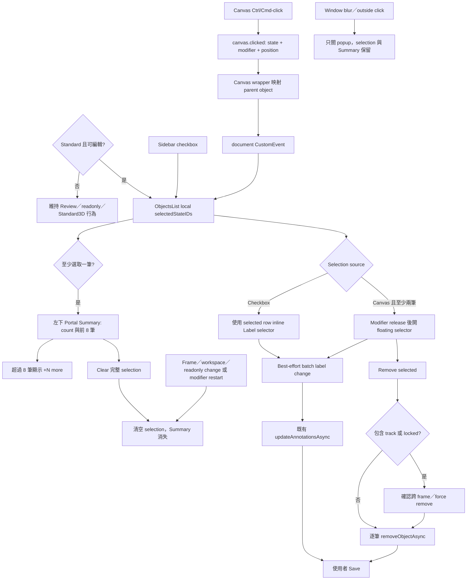

# 4. 在 Standard Workspace 提供物件多選、批次操作與 Selected Objects Summary

#### Date:
`2026-05-14`（MSA-742）；Amended `2026-05-28`（MSA-896）

#### Status
`Accepted`

#### Related Ticket

- [MSA-742](https://smartsurgerytek.atlassian.net/browse/MSA-742)
- [MSA-896](https://smartsurgerytek.atlassian.net/browse/MSA-896)

#### Related Pull Requests and Branches

- [PR #17 — MSA-742 select change label](https://github.com/smartsurgerytek/sst-cvat/pull/17)
- [PR #19 — Show selected objects summary](https://github.com/smartsurgerytek/sst-cvat/pull/19)
- [PR #20 — Selection summary review follow-up](https://github.com/smartsurgerytek/sst-cvat/pull/20)
- [來源分支 — MSA-742-select-change-label](https://github.com/smartsurgerytek/sst-cvat/tree/MSA-742-select-change-label)
- [來源分支 — MSA-896-select-list](https://github.com/smartsurgerytek/sst-cvat/tree/MSA-896-select-list)

---

## Context

本 ADR 將 PR #17、PR #19 與 PR #20 視為同一個 Standard annotation workspace 多物件操作 feature 的演進：PR #17 建立 checkbox／Canvas 多選、批次變更
Label 與 bulk remove；PR #19 以相同 selection state 加入 **Selected Objects Summary**；PR #20 則補入 PR #19 review 後已完成但漏推的命名、結構與
responsive style 修正。PR #17 於 2026-05-14 合併，MSA-896 的延伸於 2026-05-28 完成合併。

在此變更之前，Objects sidebar 的 Label selector 主要針對單一 object，Canvas 點擊與 sidebar 也沒有共享的批次 selection。使用者要把數個 objects 改為同一 label
時，必須逐筆操作；以 Canvas 找到 objects 時，也缺少同步回 sidebar 的多選狀態與集中操作入口。

我們需要同時支援兩種工作方式：使用 sidebar checkboxes 精確勾選，以及在 Canvas 按住 Windows／Linux 的 Ctrl 或 macOS 的 Command 直接點選。兩種入口必須使用同一批 selected
object IDs，但應避免 checkbox 使用者被浮動 popup 中斷，並保留 Review、readonly 與其他 workspaces 的既有行為。選取後還需要一個不依賴 sidebar scroll position
的摘要，讓使用者在操作前核對 selection 數量、object ID、label 與 type。

Label change 與 remove 仍屬於 CVAT 既有 annotation session 操作；三個 PR 都沒有新增 server-side bulk endpoint。Selected Objects Summary
也是唯讀的 UI projection，不會建立第二份 selection state。使用者完成批次操作後，仍需使用既有 **Save** 才會把 annotation 變更持久化至後端。

---

## Decision

在可編輯的 `Workspace.STANDARD` Objects sidebar 加入 checkbox-based multi-selection，並讓 Canvas Ctrl/Cmd-click 透過事件橋接到同一份
component-local selection state。

採用以下行為與架構：

1. Multi-select 只在 `workspace === Workspace.STANDARD && !readonly` 時啟用。Review、Standard 3D、其他 workspaces 與 readonly mode
   不顯示 checkbox，也不執行批次操作。
2. `ObjectsListContainer` 以本機 React state 保存目前 frame／workspace 的 `selectedStateIDs` 與 floating selector 狀態；不將暫時性的
   selection 加入 Redux，也不跨頁面持久化。
3. Sidebar 的每個 object row 顯示 checkbox。勾選的 row 加上 multi-selected class 與虛線框；checkbox 與 row Label selector 會停止 mouse event
   propagation，避免同時觸發 row activation。
4. Checkbox flow 不顯示 floating selector：
   - 在任一已選 row 的 inline Label selector 選擇新 label 時，對整批 selection 執行 label change；
   - 在未選 row 變更 label 時，只更新該 row，原有 multi-selection 保持不變。
5. Canvas flow 依序經過以下事件：
   - `cvat-canvas` 的 `canvas.clicked` 附帶 object state、`ctrlKey`、`metaKey` 與 client coordinates；
   - Canvas wrapper 將 skeleton element 映射到 parent object，並在 Standard workspace dispatch
     `cvat.objects.sidebar.toggle-multi-selection` document `CustomEvent`；
   - Objects sidebar 驗證 payload，以 object `clientID` toggle 同一份 `selectedStateIDs`。
6. Canvas 連續 Ctrl/Cmd-click 時先暫存最後 object 與游標位置。只有 modifier key release 且至少選取兩個 objects 時，才在最後點擊附近開啟 floating Label
   selector；位置會限制在 viewport 邊界內。
7. Floating selector 的候選 labels 取自一個相容的 selected source object。若最後點擊的是 skeleton，會往回尋找另一個可變更 label 的 selected object；沒有相容
   source 時不顯示 selector。
8. Batch label change 採 best-effort：逐一確認 object 非 skeleton、未 locked，且目標 label 對該 object 適用。相容 objects 透過既有
   `updateAnnotationsAsync` 更新；其餘 objects 跳過並顯示 updated／skipped 數量 warning，同時寫入 internal debug log。
9. Floating selector 同時提供 **Remove**。此外，已選 row 的既有 Remove menu，以及 Delete／Shift+Delete shortcut，也會優先轉為 bulk remove。
10. Bulk remove 對 selected objects 依序呼叫既有 `removeObjectAsync`：
    - selection 包含 tracks 時，確認視窗說明會影響其他 frames；
    - selection 包含 locked objects 時，確認後以 force remove；
    - Shift+Delete 可直接走 force path。
11. Frame、workspace 或 readonly 狀態改變時清空 selection；objects 因 filter／annotation 更新而離開目前 snapshot 時，移除已不存在的 IDs，並關閉失效的
    pending／visible selector。
12. 再次按下 Ctrl 或 Meta 會開始新的 selection session，並清除既有 selection。Window blur 或 selector 外部點擊只關閉 floating selector，保留 sidebar
    checkboxes 的 selection。
13. Editable Canvas 在 Ctrl/Cmd 按住期間仍允許一般 object hover activation，讓使用者點擊前看清目標；`forceDisableEditing` 的 Review／readonly 保護與
    Alt 行為維持不變。
14. PR #19／#20 的 Selected Objects Summary 直接讀取同一份 `selectedStateIDs`，不新增 Redux state。只要在可編輯 Standard workspace 選取至少一筆
    object 就顯示；第一筆 Canvas Ctrl/Cmd-click 後會立即出現，不必等待 modifier release。
15. 摘要標題依數量顯示 `Selected object (1)` 或 `Selected objects (N)`；內容依使用者選取順序列出 label color、`#clientID`、label
    name、shape／object type，Ground Truth object 另標示 `GT`。
16. 摘要最多 render 前 8 筆，其餘顯示 `+N more`。這只是顯示上限，batch label／remove 仍作用於完整 selection；摘要不提供展開、逐筆取消、relabel 或 remove。
17. 摘要以 portal 掛在 `document.body` 並 fixed 於 viewport 左下方，`z-index: 900` 低於 floating Label selector 的 `1100` 與確認
    modal。Clear icon 會清除完整 selection；frame、workspace、readonly、annotation snapshot 與 modifier restart 的既有 cleanup
    也會同步使摘要消失。
18. PR #20 將 summary 命名從容易誤解的 multi-selection 改為 selection summary、抽出 `renderSelectionSummary()`、以 rem 取代文字相關 px，並以
    `max(0px, calc(...))` 避免窄 viewport 算出負的 max-width；保留單選也顯示的需求。
19. 不新增 backend API、model、migration 或 schema。跨 Canvas 與 sidebar 的協調採用既有 `canvas.clicked` 加 document `CustomEvent`，實際
    label／remove 仍沿用既有 ObjectState、Redux annotation action、history 與 Save 流程。

---

## Consequences

### Positive:

- 使用者可從 sidebar checkbox 或 Canvas Ctrl/Cmd-click 選取同一批 objects，減少逐筆變更 Label 的重複操作。
- Checkbox flow 使用既有 row Label selector，Canvas flow 則在 modifier release 後才出現 popup，避免連續點選時 popup 遮住 Canvas。
- 同時支援 Ctrl 與 Meta modifier，涵蓋 Windows／Linux 與 macOS 的常見操作方式。
- Skeleton element click 能映射到 parent sidebar row；frame、workspace、readonly 與 object snapshot 變化也會清除 stale selection。
- Locked、skeleton 與 label-incompatible objects 不會被批次 relabel，部分跳過時有使用者 warning 與 internal log。
- Track／locked object 的批次刪除有確認步驟，並明確說明跨 frame 或 force remove 的影響。
- Selected Objects Summary 從第一筆 selection 就提供數量、ID、label color／name、type 與 GT 資訊；不必把 Objects sidebar 捲到每一個 selected row
  才能核對目標。
- Summary 與 checkbox、Canvas flow 共用 `selectedStateIDs`，因此 frame／workspace cleanup、batch success 與 Clear 不會產生第二套不同步的
  selection。
- Portal 不受 Objects sidebar 的 overflow clipping；八筆顯示上限也限制了摘要高度，超過時仍保留完整 selected count。
- PR #20 將 review 對命名、render 可讀性、rem 單位與窄 viewport width 計算的意見納入最終版本。
- 重用既有 annotation update、delete、history 與 Save 路徑，不需部署後端 migration 或新 endpoint。

### Negative:

- Selection 只存在 `ObjectsListContainer`，Canvas 並不繪製多物件 selection outlines；使用者主要依靠 sidebar checkboxes 與虛線 row 判斷選取結果。
- Canvas → wrapper → document `CustomEvent` → sidebar 的資料流依賴全域字串事件與固定 DOM IDs。Sidebar ID、mount timing 或 event contract
  重構都可能中斷同步，且不易由 Redux DevTools 追蹤。
- Floating selector 的 labels 來自單一 source object，而不是所有 selected objects 的 label intersection。Mixed shape／label selection
  可能只更新部分 objects，且 popup 顯示 source label，沒有 mixed／indeterminate 狀態。
- Batch label change 會在 dispatch 後清除 selection，並以多個 `ObjectState.save()` 的 `Promise.all` 執行；它不是 transaction，部分 save
  成功後另一筆失敗時可能形成 partial update。
- Label change 沿用既有 core 語意，不只替換顯示名稱；不適用於新 label 的 attributes 可能被移除或重設，track 的 mutable attributes 也可能受影響。批次操作會一次放大此影響。
- Bulk remove 在開始前清空 selection，再逐筆呼叫單物件 delete、logger 與 history。單筆失敗不會 rollback 已完成的刪除，也沒有整批成功／失敗摘要。
- Batch label 與 remove 只修改目前 annotation session；若使用者未 Save、Save 失敗或離開頁面，後端資料不會反映完整批次操作。
- 全 skeleton selection 找不到可用的 label source，因此 floating selector 連同內嵌 Remove button 都不顯示；使用者仍可用 selected row menu 或
  Delete shortcut，但可發現性較低。
- 只有兩個以上 selected objects 才改走 batch action。只有一個 checkbox selection 時，Delete 仍以目前 activated object 為主，兩個狀態可能不是同一 object。
- Selection 存在時，Delete 會優先刪除整批，即使目前 hover／activated object 不在 selection；一般未 locked、非 track 的多物件刪除不另行確認。
- Summary 是 fixed 的 Canvas overlay，沒有碰撞偵測、拖曳、收合或 viewport-height clamp；它會攔截覆蓋區域的 pointer events，窄螢幕或選取左下方 objects
  時可能妨礙操作。
- 第 9 筆以後只顯示 `+N more`，無法展開或逐筆核對／取消，但 destructive batch action 仍會作用於全部 selected objects。
- Summary row 不是互動式清單，不能由摘要定位 object、單筆 deselect、變更 Label 或 Remove；相關操作仍分散在 sidebar row、floating selector 與 shortcut。
- Summary 使用 session 內的 `clientID` 作為辨識資訊，而不是可跨 session 引用的 server-side audit ID；它適合當下核對，不適合作為持久紀錄。
- `renderSelectionSummary()` 每次 render 都會先為全部 `filteredStates` 建立 ID Map，再取最多 8 筆顯示；大型 job 的額外 O(N) client-side churn 尚未
  benchmark。
- 本次沒有提供 select-all、Shift range selection 或跨 frame selection；切換 frame／workspace 會刻意清空選取。
- Checkbox 沒有 object-specific accessible name；Summary 也沒有 semantic list、accessible region heading 或
  `aria-live`，selection 數量變化不會主動通知 screen reader，keyboard 體驗不足。

---

## Implementation Notes

| 責任 | 檔案 |
| --- | --- |
| Canvas click payload、Ctrl/Cmd hover 行為 | [`canvasView.ts`](../../../cvat-canvas/src/typescript/canvasView.ts) |
| Canvas-to-sidebar event bridge 與 skeleton parent mapping | [`canvas-wrapper.tsx`](../../../cvat-ui/src/components/annotation-page/canvas/views/canvas2d/canvas-wrapper.tsx) |
| Sidebar DOM target 與 CustomEvent contract | [`objects-sidebar-multi-select.ts`](../../../cvat-ui/src/utils/objects-sidebar-multi-select.ts) |
| Selection lifecycle、floating selector、batch label／remove、Selected Objects Summary | [`containers/.../objects-list.tsx`](../../../cvat-ui/src/containers/annotation-page/standard-workspace/objects-side-bar/objects-list.tsx) |
| 將 selection 與 bulk handlers 傳至 object rows | [`components/.../objects-list.tsx`](../../../cvat-ui/src/components/annotation-page/standard-workspace/objects-side-bar/objects-list.tsx) |
| Row checkbox、inline Label selector 與 event isolation | [`object-item-basics.tsx`](../../../cvat-ui/src/components/annotation-page/standard-workspace/objects-side-bar/object-item-basics.tsx) |
| Selected row class 與 presentational wiring | [`components/.../object-item.tsx`](../../../cvat-ui/src/components/annotation-page/standard-workspace/objects-side-bar/object-item.tsx) |
| 將 row label／remove 轉交 batch handler | [`containers/.../object-item.tsx`](../../../cvat-ui/src/containers/annotation-page/standard-workspace/objects-side-bar/object-item.tsx) |
| Multi-select row、popup、Remove button 與 fixed Summary 樣式 | [`styles.scss`](../../../cvat-ui/src/components/annotation-page/standard-workspace/objects-side-bar/styles.scss) |
| Standard／Standard3D ObjectsList call sites | [`standard-workspace.tsx`](../../../cvat-ui/src/components/annotation-page/standard-workspace/standard-workspace.tsx), [`standard3D-workspace.tsx`](../../../cvat-ui/src/components/annotation-page/standard3D-workspace/standard3D-workspace.tsx) |
| Multi-select Cypress spec | [`multi_select_label_change.js`](../../../tests/cypress/e2e/features2/multi_select_label_change.js) |

相關 Git 歷史：

- `d1e849ada`：新增 Canvas Ctrl/Cmd multi-select、sidebar checkbox 與 batch label change。
- `835f4fca5`：改善 modifier restart、selection reset 與三選二後的 popup 行為。
- `fc69e00b9`、`286906800`：調整 sidebar／popup UX，並補上 frame、workspace、readonly cleanup 與 Ctrl／Meta 對齊。
- `377098f53`：讓 selected row 的 inline Label selector 共用 batch flow，並加入 popup source fallback。
- `446a112c8`、`56347548b`：整理 popup 與 Cypress 操作穩定性。
- `0bf1364bc`：新增 bulk remove、track／locked confirmation 與 Delete shortcut 整合。
- `4277efe16`：補充 Objects sidebar multi-select flow 註解。
- `3d711b726`：修正 Remove button 與 label dropdown 重疊。
- `5664d272c`：修正 Objects list ESLint 問題，為來源 branch tip。
- `7e7cf16b8`：PR #17 合併至 `sst-main`。
- `25c9c24b1`：在 `MSA-896-select-list` 加入讀取 `selectedStateIDs` 的 fixed Selected Objects Summary；為 PR #19 head。
- `95339862d`：PR #19 合併至當時已包含 PR #18 的 `sst-main`。
- `78f02da1a`：同一來源分支補入 PR #19 漏推的 review follow-up，整理命名、render method、rem 與窄 viewport max-width；為 branch 最終 tip 與 PR #20
  head。
- `12c6cee6a`：PR #20 合併至 `sst-main`，完成 MSA-896 extension。

`MSA-896-select-list` 是從 PR #17 merge commit `7e7cf16b8` 延伸；PR #19 開發期間 PR #18 先進入 main，因此 PR #19 merge 的 first parent 是
`668996bfb`，second parent 才是 `25c9c24b1`。功能範圍應以 PR #19／#20 各自的 merge first-parent diff 判讀；若直接拿 PR #18 merge 與來源 branch
tip 比較，會把不相關的 History／job autosave 誤顯示成刪除。

### Known Implementation Issues

1. **`readonly` prop 的 TypeScript contract 不一致**

   PR #17 將 component 改為 `ConnectedProps` 並移除原本的 `defaultProps = { readonly: false }`，但 `OwnProps.readonly` 仍是必填。來源
   branch 的 Standard 與 Standard3D call sites 都使用 `<ObjectsListContainer />`，沒有傳入此 prop。

   在目前保留相同 contract 的 `sst-main` 執行 TypeScript check 時，會分別在 `standard-workspace.tsx:27` 與 `standard3D-workspace.tsx:24`
   回報 `TS2741: Property 'readonly' is missing`。Runtime 中 Standard 會把 `undefined` 視為非 readonly 而啟用功能，但型別檢查不接受。完整
   type-check 同時存在許多其他 repository errors，因此不能宣稱這是唯一 build blocker；仍應將 `readonly` 改為 optional/defaulted，或由兩個 call sites
   明確傳值。

2. **任何 window-level Ctrl／Meta keydown 都會清空 selection**

   Modifier handler 沒有檢查 event target。當使用者在 input、Label selector 或其他控制項使用 Ctrl/Cmd+C、V、A 等 shortcut 時，只要已有
   selection，也會開始新的 session 並清空選取。

3. **Floating Remove 與 Summary Clear button 的 mouse event 不完整**

   兩個 button 都只綁定 `onMouseDown`，沒有 `onClick`，handler 也沒有檢查 `event.button`。因此鍵盤 Enter／Space 產生的 click 不會執行刪除或清除；中鍵或右鍵
   mousedown 反而也會觸發對應 action。handler 的 `preventDefault()` 也會阻止一般 pointer focus。對一般未 locked、非 track objects，Remove path
   不顯示確認視窗。

4. **Summary 的 responsive 與 accessibility 邊界不足**

   PR #20 避免了負的 max-width，但 fixed window 沒有 viewport-height clamp、collision detection 或 media query；極窄／極短 viewport 及高
   zoom 仍可能得到不可用寬度或遮住 Canvas。Summary 也沒有 semantic list、region label 或 `aria-live`；Clear icon 只有 `title` 而沒有明確
   `aria-label`，selection 更新不會主動通知 screen reader。

本 ADR 只記錄上述既存問題，沒有修改功能程式碼。

### Validation Boundary

PR #17 新增的 Cypress spec 有 11 個直接案例，沒有功能缺失時改走 API 的 conditional fallback。依程式碼靜態檢查，它會驗證：

- Sidebar checkbox 選取兩個 rectangles 時不顯示 floating selector；在 selected row 改 Label 會同時更新兩列並清空 selection。
- 已選兩列時，在未選第三列改 Label 只更新第三列，原 selection 維持。
- Checkbox 或 Canvas selection 在下一次 Ctrl／Meta keydown 時清空。
- Canvas Ctrl/Cmd-click 會同步 sidebar checkboxes；modifier release 前不顯示 popup，release 後才顯示。
- 外部點擊與 window blur 會關閉 popup；三選二後 release 仍會顯示 popup。
- 換 frame 或 Standard → Review → Standard 會清空 selection，Review 不顯示 checkboxes 或 floating selector。

該 spec 的重要限制：

- Floating selector 只測存在與關閉，沒有實際選擇 Label；Cypress 因此沒有證明 Canvas batch label path 可完成更新。
- PR 新增的 bulk Remove、Delete shortcut、track／locked confirmation、force remove 與失敗路徑完全沒有 assertions。
- 沒有執行 Save／reload 或攔截 API；server persistence、Undo／Redo 與 partial failure 未驗證。
- 測試資料只有 `type: any` 的兩個 labels 與 rectangles，未涵蓋 mixed shape
  types、tags、tracks、masks、skeleton、locked、hidden、outside、ground truth 或 label incompatibility。
- 多處使用 `{ force: true }` click，無法證明真實 UI 沒有被遮擋且能正常 hit-test；modifier 也是合成 `window.KeyboardEvent`，不是實體鍵盤輸入。
- 測試只會依執行平台選擇 Ctrl 或 Meta，不能據此宣稱 macOS Command 與其他平台都已驗證。
- Blur／outside-click case 只斷言 popup 關閉，沒有斷言 selection 應保留；popup positioning／clamping、Remove overlap、hover
  highlight、readonly、Standard 3D、accessibility 與 responsive layout 也未覆蓋。
- PR #19／#20 沒有新增或修改任何 test。現有 spec 沒有引用 Summary selector 或文字，因此 Summary 完全不 render 時，這 11 個案例仍可能通過。
- Summary 的單筆顯示、總數與選取順序、前 8 筆／`+N more`、ID／label／type／GT、Clear、全部 selection 的 batch target、modal layering、固定位置、窄
  viewport、高 zoom、keyboard 與 screen reader 都沒有 automated assertion。

單獨執行現有 spec：

```bash
cd tests
yarn run cypress:run:chrome --spec cypress/e2e/features2/multi_select_label_change.js
```

PR #19 與 PR #20 的 GitHub Docs workflow，以及包含 ESLint／Stylelint 在內的 10 個 linter jobs 均成功；但兩個 head 的 PR Build Check 都在沒有建立任何
job 時失敗。當時 `pr-build.yml` 呼叫 reusable `build-images.yml`，後者連 `on.workflow_call` 與 `jobs` 都被註解，因此這是 build 開始前的 workflow
configuration failure，不能歸因於本 feature，也不能作為 Docker image 或 application compilation 通過的證據：

- [PR #19 Build Check run #26](https://github.com/smartsurgerytek/sst-cvat/actions/runs/26389182476)
- [PR #20 Build Check run #27](https://github.com/smartsurgerytek/sst-cvat/actions/runs/26567601121)

本 ADR 修訂期間已重新執行兩個最終目標檔的 ESLint、Stylelint，以及 PR #19／#20 merge first-parent patch 的 `git diff --check`，結果均通過。未執行
Cypress、完整 webpack／Docker build、瀏覽器 responsive／accessibility 或實體裝置驗收。亦曾執行 project-level TypeScript check：

```bash
./node_modules/.bin/tsc --noEmit -p cvat-ui/tsconfig.json --pretty false
```

該 TypeScript command 以 exit code `2` 結束，除了許多既有 repository errors，也包含前述兩個 `readonly` `TS2741`；PR #19／#20 修改的
`objects-list.tsx` 本身沒有出現在 diagnostics，但整體結果仍不構成 type-check 或 build acceptance。

---

## Alternatives Considered

- **只提供 sidebar checkbox，不支援 Canvas Ctrl/Cmd-click**：架構較簡單且不需要跨 component event，但使用者必須在 Canvas 與長 sidebar list 之間反覆定位
  objects。
- **以 Ctrl/Cmd-click sidebar row 取代 checkbox**：減少 row 空間，但操作較不易發現，且與 row activation、label selector、menu clicks 更容易衝突。
- **把 selection 放入 Redux**：能集中型別、DevTools trace 與跨 component 同步，但會把 frame-local、短生命週期的 UI state 擴大到 global store，增加
  action、reducer 與 cleanup 成本。
- **由 Canvas 提供正式 multi-selection API，不使用 DOM ID／CustomEvent bridge**：可降低全域事件與 sidebar DOM 耦合，也能在 Canvas 畫 selection
  outlines；代價是擴大 cvat-canvas public contract 與 selection model。
- **把目前唯讀 Summary 做成固定 batch action bar**：Checkbox 與 Canvas flow 會有一致的 Label／Remove 入口，也較利於鍵盤操作；但會重複或取代 PR #17 的 row
  selector／floating popup，且 destructive action 永久浮在 Canvas 上需要更完整的確認與 accessibility 設計。
- **把 Summary 放在 Objects sidebar 的 sticky panel，不使用 body portal**：不會遮住 Canvas，且與 object list 的關聯更直接；代價是壓縮 sidebar 可用高度，窄
  sidebar 也較難呈現 ID、label 與 type。
- **提供可展開或 virtualized 的完整 selected list與逐筆 deselect**：能在 destructive batch action 前核對全部 targets；代價是額外的
  focus、scroll、virtualization 與 selection synchronization 複雜度。
- **Label selector 只顯示所有 selected objects 的共同 label intersection，並採 all-or-nothing update**：可避免 partial update 與 skipped
  warning，但 mixed object selection 可用選項會更少，且仍需 transaction／rollback 設計。

## Embedded Attachments

### Multi-select, Summary and Batch Action Flow

<div style="zoom:75%;">



</div>
