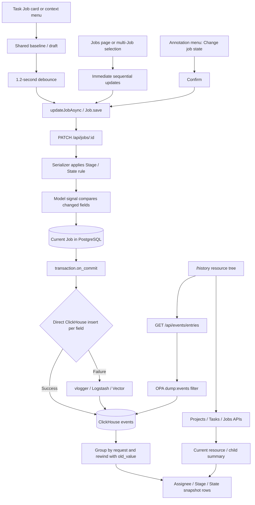

# 5. Provide Job Field Autosave and Hierarchical Assignee/Stage/State History

[繁體中文](README.md) | **English**

#### Date:
`2026-05-28`

#### Status
`Accepted`

#### Related Ticket
[MSA-825](https://smartsurgerytek.atlassian.net/browse/MSA-825)

- [PR #18 — MSA-825 CVAT assignee stage](https://github.com/smartsurgerytek/sst-cvat/pull/18)
- [Source branch — MSA-825-cvat-assignee-stage](https://github.com/smartsurgerytek/sst-cvat/tree/MSA-825-cvat-assignee-stage)

---

## Context

PR #18 improves assignment and workflow tracking across Projects, Tasks, and Jobs. This ADR covers only the MSA-825 changes: editing and autosaving Job Assignee, Stage, and State fields, together with the hierarchical History browser. It excludes the object multi-selection introduced by PR #17 and any later Review, tablet, or selection UI changes.

Before this change, the three selectors on a Task page Job card saved independently and immediately, while the card and its context actions menu could show different draft values. When users changed several fields in quick succession, there was no consistent pending, saving, or error state, no Undo or Retry operation, and no clear indication of how a Stage change affected State.

CVAT could already export events as CSV, but it did not provide an interactive page suitable for daily use. An administrator or staff member who needed to determine who changed an assignment, Stage, or State and when had to leave the resource context and analyze an exported file. They also could not browse current values and historical snapshots hierarchically from Project to Task to Job.

The current Job value is stored in PostgreSQL, while History is sourced from ClickHouse `events`. These are separate persistence paths and do not participate in one transaction. This ADR therefore treats “the Job update succeeded” and “the corresponding event is queryable in History” as separate success conditions. History is not defined as a legally complete audit log.

---

## Decision

Add a top-level **History** browser and use a shared draft on the Task page to unify single-Job Assignee, Stage, and State editing with delayed autosave.

Adopt the following behavior and architecture:

1. Add `/history` as an authenticated application route and expose a **History** entry in the Header alongside Projects, Tasks, and Jobs.
2. Present two lazy-loaded paths in the History tree:

   - Project → Task → Job;
   - Standalone tasks → Job.

   Projects support search and newest, oldest, or name sorting. Project, Task, and Job children load at most 100 records per request, with a UI `Load more` node for further pagination.
3. When a Project or Task is selected, the right panel shows current resource information and a summary of its direct children: Projects show Tasks, and Tasks show Jobs. The summary uses server-side pagination, defaults to 10 rows, and supports 10, 20, or 50 rows per page. Selecting a summary row ensures that its tree path is loaded and then drills down to it.
4. A History query represents changes to the selected resource itself; it does not aggregate descendants:

   - Project: `scope=update:project`, `obj_name=assignee`;
   - Task: `scope=update:task`, `obj_name=assignee`;
   - Job: `scope=update:job`, `obj_name=assignee,stage,state`.

5. Add a `GET /api/events/entries` JSON endpoint. It accepts resource, actor, date, scope, object name, page/page size, cursor, and `include_count` filters, and returns `count`, `has_more`, `next_cursor`, and event rows. Query values use bound parameters, while select and sort clauses use allowlists.
6. Add a handwritten TypeScript contract and snake_case-to-camelCase adapter for `analytics.events.list()` in `cvat-core`. History requests up to 100 events per batch, uses an opaque cursor, and sets `includeCount: false` to avoid an exact `COUNT` query on every page.
7. `/events/entries` reuses the `dump:events` OPA allow/filter rules from CSV event export:

   - A sandbox administrator can see sandbox events; a regular sandbox user can see only events where they are the actor.
   - An owner or maintainer in the active organization can see organization events; supervisors and workers remain restricted by actor user and organization.

   This authorization model controls event actor/organization visibility. It does not re-run current object permissions for each Project, Task, or Job.
8. Project, Task, and Job updates continue to use the generic model-signal diff. Each changed field emits one event: `obj_name` identifies the field, `obj_val` contains the new value, and `payload.old_value` contains the previous value. `user_id/name/email` identify the actor who made the change, not the newly assigned user.
9. The event callback runs after the PostgreSQL transaction commits. The server first inserts directly into the existing ClickHouse `events` table. If the direct write fails, it writes through `vlogger` so the existing Logstash/Vector pipeline can deliver the event to ClickHouse. This flow adds no PostgreSQL audit model, ClickHouse table, or data backfill.
10. History groups Assignee, Stage, and State events with the same request ID into one row. The table does not merely display an old-to-new delta. Starting from the current resource snapshot, it applies event `old_value` fields in reverse to reconstruct the field snapshot immediately after each save. If an event has no request ID, the fallback grouping key combines timestamp, actor, scope, resource, and request metadata.
11. History defaults to **All time**, with a fixed 10-row UI page size, and also offers **Last 30 days** and custom date ranges. To reconstruct the snapshot at the end of a bounded range, the client first reads events for the same resource after `to + 1 ms`, then applies their `old_value` values backwards.
12. A single Job card on the Task page keeps component-local `baseline` and `draft` values for Assignee, Stage, and State. Each edit resets an `AUTOSAVE_DELAY_MS = 1200` timer. When it expires, the card PATCHes only fields that differ from the baseline, allowing rapid edits to several fields to be coalesced into one request.
13. A single Job displays pending, saving, and error states. Selectors are disabled while saving. A failed save retains the draft and offers **Retry**, while **Undo** is available whenever a difference remains. The `updateJobAsync` Promise must propagate back to the Job card so the UI can await the result correctly.
14. The Task page Job card and its context actions menu share the same `singleJobDraft`. The menu updates the shared draft and closes its editor instead of keeping a second copy. The Job card debounce flow remains responsible for the PATCH.
15. When Stage changes and the user has not explicitly changed State, the frontend draft previews State as `NEW`, matching the existing backend `JobWriteSerializer` rule. If the user explicitly selects a State, the single-Job flow PATCHes Stage and State together, and the explicit State overrides the default.
16. Multiple selected Jobs, and the action menu on the standalone `/jobs` page when it has no `singleJobDraft`, retain immediate saving. They call the existing `updateJobAsync` sequentially instead of using a new transactional bulk endpoint. For a Stage-only request, the backend resets State to `NEW`.
17. **Change job state** in the annotation workspace continues to use the existing `updateJobAsync` path, but the current value is no longer selectable and a confirmation dialog explains that the change will be recorded in History before it is persisted immediately.
18. Tree expansion, selection, search, sort, pagination, and date range remain page-local React state. They are not stored in Redux, URL query parameters, or localStorage. Each asynchronous loader uses request IDs or request deduplication to keep stale responses from replacing the current selection, and reports errors with Ant Design notifications.

---

## Consequences

### Positive:

- A single top-level entry lets users browse current information and visible change history through Project → Task → Job or Standalone Task → Job.
- Project/Task summaries and Job details put current state and change history into one drill-down flow, reducing the operational cost of analyzing CSV exports.
- The single Job card and context menu share one draft, so one entry point does not show stale values while the other still has unsaved changes.
- The 1.2-second debounce can coalesce rapid Assignee, Stage, and State edits, and History can group field events from the same request into one row.
- Pending, saving, Retry, and Undo states make the autosave lifecycle visible instead of forcing users to infer success or failure from a selector reverting.
- The frontend Stage/State preview matches the backend rule while preserving the user's ability to specify State explicitly.
- The tree, summaries, and events use lazy or paged loading. History cursor mode avoids an exact count and is better suited to long histories.
- Search, sort, selection, and date changes use stale-response guards, reducing the chance that an older response overwrites a newer view during rapid interaction.
- ClickHouse query values are bound parameters, and the cursor tie-breaker avoids the common cross-page duplication or skipping caused by timestamp-only pagination.
- The implementation reuses the existing Job PATCH, event signals, OPA policy, and ClickHouse infrastructure. It adds no Django migration, Job API endpoint, or audit table.

### Negative:

- Job updates and History events do not share a datastore transaction. PostgreSQL may succeed while the direct ClickHouse write, logger fallback, or Vector ingestion is delayed, fails, or duplicates an event. A correct current Job value therefore does not guarantee complete History.
- Every changed property creates a new ClickHouse client and inserts separately. Updating Assignee, Stage, and State, plus a backend-derived legacy status, may create several synchronous post-commit connections. The existing batch-insert helper is not used by the update handler.
- The event table is ordered only by timestamp and has neither a unique event ID nor a TTL. All-time scans, long ranges, and broad scopes can be expensive, while rows with fully identical cursor tuples may be skipped by the strict `<` cross-page condition.
- `/events/entries` returns actor email and full payload/request metadata, which exceeds what the History UI currently needs. Although protected by `dump:events`, it expands the sensitive-data surface and long-term retention risk.
- Event permissions filter by actor and organization and can differ from current resource visibility. Seeing a Project, Task, or Job in the tree does not imply that the user can see every other actor's changes to that resource.
- History queries only `update:*` events. Initial assignment at resource creation, `QuerySet.update()` or data repair that bypasses model signals, and pre-PR events that never reached ClickHouse are not backfilled.
- The UI reconstructs snapshots client-side from the current resource and multiple pages of events, which are not a consistent snapshot. If the resource changes during the query or an event is missing, rows can be temporarily misaligned.
- A custom end date requires scanning every relevant event after that date to establish the base snapshot. As history grows, this cost is not bounded by the 10 rows shown on the page.
- Project and Task History show only the resource's own Assignee changes; descendant Job Assignee, Stage, and State changes are not rolled up. The summary shows current child values, which has different semantics from Change history.
- History browser state is not encoded in the URL. Refreshing, leaving the page, using browser Back, or sharing a link does not preserve selection, expanded nodes, search, sort, page, or date range.
- Single-Job autosave has no revision or ETag and remains last-writer-wins when another tab, bulk action, or external update runs concurrently. An external prop refresh also resets the local draft to the server snapshot.
- The bulk path issues sequential PATCH requests and is not all-or-nothing. If early items succeed and a later item fails, completed updates are not rolled back; retry starts from the failed and remaining items.
- Field controls are not hidden or disabled based on actual field permissions. An unauthorized user can modify the UI and sees an error only after the PATCH returns 403.
- The single-item action menu on standalone `/jobs` does not have the Task Job card's 1.2-second draft, Undo, or inline Retry behavior, so autosave interaction is not fully consistent across the two pages.
- History tables do not configure horizontal scrolling or responsive columns. Search, sort, and date controls also lack explicit accessible labels, and another fixed Header button increases crowding on narrow screens.

---

## Implementation Notes

| Responsibility | File |
| --- | --- |
| History route and Header entry | [`cvat-app.tsx`](../../../cvat-ui/src/components/cvat-app.tsx), [`header.tsx`](../../../cvat-ui/src/components/header/header.tsx) |
| History page composition and two-column layout | [`history-page.tsx`](../../../cvat-ui/src/components/history-page/history-page.tsx), [`styles.scss`](../../../cvat-ui/src/components/history-page/styles.scss) |
| Project/Task/Job tree, search, sorting, and lazy pagination | [`use-history-tree.ts`](../../../cvat-ui/src/components/history-page/use-history-tree.ts), [`history-tree.tsx`](../../../cvat-ui/src/components/history-page/history-tree.tsx) |
| Project/Task child summaries | [`use-history-summary.ts`](../../../cvat-ui/src/components/history-page/use-history-summary.ts) |
| Resource details, date range, cursor fetch, and snapshot reconstruction | [`use-history-records.ts`](../../../cvat-ui/src/components/history-page/use-history-records.ts), [`history-right-panel.tsx`](../../../cvat-ui/src/components/history-page/history-right-panel.tsx) |
| History types, query scopes, request grouping, and value formatting | [`history-utils.ts`](../../../cvat-ui/src/components/history-page/history-utils.ts) |
| Core event types, public list API, and response mapping | [`server-response-types.ts`](../../../cvat-core/src/server-response-types.ts), [`index.ts`](../../../cvat-core/src/index.ts), [`api-implementation.ts`](../../../cvat-core/src/api-implementation.ts) |
| `/api/events/entries` Axios adapter | [`server-proxy.ts`](../../../cvat-core/src/server-proxy.ts) |
| JSON endpoint query/response validation | [`views.py`](../../../cvat/apps/events/views.py), [`serializers.py`](../../../cvat/apps/events/serializers.py) |
| ClickHouse filters, cursor, pagination, and payload deserialization | [`export.py`](../../../cvat/apps/events/export.py) |
| Event diff and post-commit ClickHouse/logger dispatch | [`handlers.py`](../../../cvat/apps/events/handlers.py), [`event.py`](../../../cvat/apps/events/event.py) |
| Event API permission mapping and OPA filters | [`permissions.py`](../../../cvat/apps/events/permissions.py), [`events.rego`](../../../cvat/apps/events/rules/events.rego) |
| Task Job card baseline/draft, debounce, Retry, and Undo | [`job-item.tsx`](../../../cvat-ui/src/components/job-item/job-item.tsx) |
| Shared card/menu draft and immediate multi-Job updates | [`actions-menu.tsx`](../../../cvat-ui/src/components/jobs-page/actions-menu.tsx) |
| Stage-to-State client preview rule | [`job-workflow.ts`](../../../cvat-ui/src/utils/job-workflow.ts) |
| Job update thunk and authoritative backend workflow rule | [`jobs-actions.ts`](../../../cvat-ui/src/actions/jobs-actions.ts), [`engine/serializers.py`](../../../cvat/apps/engine/serializers.py) |
| Mocked event API unit tests | [`test_events.py`](../../../cvat/apps/events/tests/test_events.py) |

Relevant Git history:

- `57fd399e0`: Add the Job History JSON API, ClickHouse query, and direct event-write path.
- `2e8b68e50`: Add the History page, tree, details, summaries, and browser flow.
- `5fc773d53`: Adjust Job batch updates and State save UX.
- `9a736043f`, `363e05261`: Tighten History typing, remove an unused helper, and add in-panel Back navigation.
- `b8ab37619`: Add Assignee/Stage/State debounce autosave and pending/error UI.
- `9dc64884b`: Include Project and Task Assignee History in the same browser.
- `da14fdd11`, `ff6d26220`: Fix the shared draft and browser reset behavior and document the data flow.
- `8c9e9c098`: Make All time the default date range, add active presets, and fix History pagination at 10 rows.
- `ca46aaadd`, `2c099d4e7`: Harden ClickHouse export/list query allowlisting and clean up Python formatting.
- `0dc5a3b98`: Split the large browser hook into tree, summary, and records hooks; this is the source branch tip.
- `668996bfb`: Merge PR #18 into `sst-main` on 2026-05-28.

### Known Implementation Issues

1. **Leaving the page does not flush an unsent autosave draft**

   Job card unmount cleanup only clears the 1.2-second timer. If the user leaves the Task page, triggers an unmount, or receives an external Job snapshot refresh before the timer fires, the pending draft can be discarded without a PATCH. Requests already in flight are not cancelled, but the component uses a mounted guard to prevent subsequent setState calls.

2. **A bounded date-range fallback can display an incorrect snapshot**

   The UI must first retrieve events after `to` to rewind to the range-end snapshot. If that base query fails, the application reports an error but continues to reconstruct and display older rows using the current resource value as a fallback. This can produce history that appears complete but has incorrect field values. A safer behavior would fail closed or mark the snapshot as incomplete.

3. **“Last 30 days” actually spans 31 calendar dates**

   The preset ranges from `dayjs().subtract(30, 'day').startOf('day')` through today's `endOf('day')`. Counting today as one day includes today plus the previous 30 days, for 31 calendar dates.

4. **A failed summary request can leave rows from the previous page visible**

   When a Project/Task summary page or page-size request fails, the error path shows a notification but does not clear the previous data. The pager can point to the new page while the table still shows Tasks or Jobs from the old page.

5. **The new endpoint is absent from the checked-in OpenAPI/SDK, and parameter documentation has drifted**

   Although `/api/events/entries` has a DRF `extend_schema`, the route is absent from the current `cvat/schema.yml` and generated SDK; the UI depends on a handwritten `cvat-core` adapter. The `entries` and CSV export endpoints also share one documented parameter set: entries advertises the irrelevant `filename` parameter, while CSV export advertises scope, obj_name, page, cursor, and include_count even though it does not apply them.

This ADR records these existing issues but does not modify feature code.

### Validation Boundary

PR #18 adds 17 mocked unit tests in `cvat/apps/events/tests/test_events.py`. Static inspection shows that they cover:

- `/events/entries` `from` mapping, invalid date ranges, cursor passthrough, and `include_count=false`.
- ClickHouse select/sort allowlists, offset/cursor paths, `has_more` and count branches, and cursors that do not directly expose user name, email, or organization slug.
- Server event dispatch, `transaction.on_commit`, direct ClickHouse insert, and logger fallback.

These tests mock OPA and ClickHouse and do not validate a real Job PATCH → model signal → ClickHouse → GET integration. The PR adds no History/autosave frontend unit test or Cypress spec, so automation does not verify:

- The 1.2-second debounce, multi-field coalescing, Retry/Undo, unmount flushing, or external refresh.
- Stage-only → State `NEW`, explicit State override, or annotation-menu confirmation.
- Multi-Job partial failure/retry, concurrent updates, or role/field permissions.
- Project/Task/Job tree behavior, standalone tasks, summary drill-down, request grouping, or snapshot reconstruction.
- All-time/custom ranges, ClickHouse outage, Vector fallback, event delay/duplication/retention.
- Narrow layouts, keyboard use, screen readers, or large-history performance.

The PR description lists manual checks for single-Job and History flows, but those steps, Django tests, Cypress, and the complete application build were not rerun while writing this ADR. The final PR check summary shows successful Docs and linter checks, but `PR Build Check` run `24976497029` failed. The available record is insufficient to determine the cause, so merged/Accepted must not be interpreted as full build acceptance.

The following command was run during this review:

```bash
./node_modules/.bin/tsc --noEmit -p cvat-ui/tsconfig.json --pretty false
```

It exited with code `2` and reported many existing repository-wide TypeScript errors, so it does not establish type-check acceptance for PR #18. The backend unit tests can be run in an environment with CVAT services and test settings:

```bash
docker exec cvat_server python manage.py test cvat.apps.events.tests.test_events -v 2
```

---

## Alternatives Considered

- **Embed History in the existing Project/Task/Job detail pages**: Resource context and URL deep links would be natural, but the table/filter UI would be duplicated and there would be no unified cross-level browser.
- **Continue to offer only CSV event export**: This works well for offline audits and bulk downloads without a new interactive API, but it is unsuitable for hierarchical drill-down, fast date switching, or comparison with current values.
- **Create a PostgreSQL audit table or transactional outbox**: Business updates and audit intent could share a transaction and then be delivered reliably to the analytics store. This provides stronger completeness but requires migrations, retention, backfill, an outbox worker, and greater operational cost.
- **Return materialized snapshots or field deltas from the server**: This avoids reconstructing from the current resource and scanning events after the end date, and makes consistency easier to define. It requires a dedicated audit read model, aggregation, and pagination contract.
- **Encode History selection, date, page, search, and sort in the URL**: This supports refresh, browser navigation, and shareable deep links, but adds complexity around lazy tree loading, URL normalization, and bidirectional local-state synchronization.
- **PATCH on every selector change**: This reduces the chance of losing a pending timer when leaving and eliminates the draft, but rapid three-field edits produce more requests and events and make card/menu coordination and error recovery harder.
- **Use explicit Save/Cancel buttons instead of debounce autosave**: The submission boundary is clear and users can review the Stage/State combination, but it adds clicks and still requires a dirty-state guard when leaving without saving.
- **Add a server-side transactional bulk Job update endpoint**: This centralizes permissions, validation, Stage/State rules, and result summaries and can choose all-or-nothing semantics. It requires a new API and transaction scope and can increase locking cost for large Job sets.

## Embedded Attachments

### Job Update and Event-backed History Flow

<div style="zoom:70%;">



</div>
