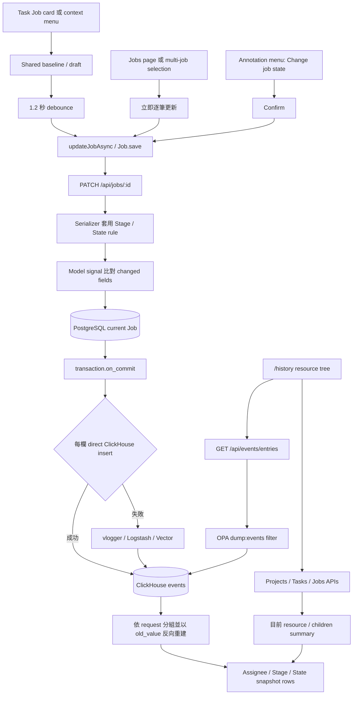

# 5. 提供 Job 欄位自動儲存與階層式 Assignee／Stage／State History

#### Date:
`2026-05-28`

#### Status
`Accepted`

#### Related Ticket
[MSA-825](https://smartsurgerytek.atlassian.net/browse/MSA-825)

- [PR #18 — MSA-825 CVAT assignee stage](https://github.com/smartsurgerytek/sst-cvat/pull/18)
- [來源分支 — MSA-825-cvat-assignee-stage](https://github.com/smartsurgerytek/sst-cvat/tree/MSA-825-cvat-assignee-stage)

---

## Context

PR #18 改善 Project／Task／Job 的指派與工作流追蹤。本 ADR 僅記錄 MSA-825 的 Job
Assignee／Stage／State 編輯、自動儲存，以及階層式 History browser；不包含 PR #17 的物件多選，亦不包含後續其他
Review、tablet 或 selection UI 變更。

在此變更之前，Task 頁 Job card 的三個 selectors 會各自立即儲存，card 與 context actions menu
也可能各自顯示不同的暫存值。使用者快速修改多個欄位時，缺少一致的 pending／saving／error 狀態、Undo 與 Retry，
也不容易知道 Stage 變更對 State 的連動結果。

CVAT 原本可匯出 events CSV，但缺少適合日常操作的互動式頁面。管理者或工作人員若要確認「誰在何時變更指派、
Stage 或 State」，必須離開目前資源脈絡分析匯出檔，且無法從 Project → Task → Job 逐層查看目前值與歷史快照。

Job 的目前值儲存在 PostgreSQL；History 則來自 ClickHouse `events`。兩者是不同的 persistence path，
並不構成同一筆 transaction。ADR 因此把「Job 已成功更新」與「對應 event 已可在 History 查到」視為不同的成功條件，
不將 History 定義為保證完整的法規級 audit log。

---

## Decision

新增頂層 **History** browser，並在 Task 頁以共用 draft 統一單筆 Job 的 Assignee／Stage／State
編輯與延遲自動儲存。

採用以下行為與架構：

1. 在 authenticated application route 加入 `/history`，並在 Header 與 Projects、Tasks、Jobs 並列顯示
   **History** 入口。
2. History 左側以 lazy-loaded tree 呈現兩條路徑：

   - Project → Task → Job；
   - Standalone tasks → Job。

   Project 支援搜尋與 newest／oldest／name 排序；Project、Task、Job children 每次最多載入 100 筆，並以 UI
   `Load more` node 繼續分頁。
3. 選取 Project 或 Task 時，右側顯示該資源目前資訊及直接 children summary：Project 顯示 Tasks，Task 顯示 Jobs。
   Summary 使用 server-side pagination，預設 10 筆，可切換 10／20／50；點擊 summary row 會補齊 tree path
   並 drill down。
4. History 查詢只代表「目前選取資源本身」的更新，不彙總 descendants：

   - Project：`scope=update:project`、`obj_name=assignee`；
   - Task：`scope=update:task`、`obj_name=assignee`；
   - Job：`scope=update:job`、`obj_name=assignee,stage,state`。

5. 新增 `GET /api/events/entries` JSON endpoint。它接受 resource、actor、日期、scope、object name、
   page/page size、cursor 與 `include_count` filters，回傳 `count`、`has_more`、`next_cursor` 及 event rows。
   查詢使用 bound parameters，select／sort clauses 採 allowlist。
6. `cvat-core` 新增 `analytics.events.list()` 的手寫 TypeScript contract 與 snake_case → camelCase adapter。
   History 每批讀取最多 100 events、使用 opaque cursor 且設定 `includeCount: false`，避免每一頁都執行精確
   `COUNT`。
7. `/events/entries` 沿用 CSV event export 的 `dump:events` OPA allow／filter：

   - sandbox admin 可查看 sandbox events；一般 sandbox 使用者只查看 actor 為自己的 events；
   - active organization 的 owner／maintainer 可查看該 organization events；supervisor／worker 仍受
     actor user 與 organization 限制。

   此權限模型是 event actor／organization visibility，不是對每一筆目前 Project／Task／Job 重新執行
   object permission check。
8. Project、Task、Job 更新沿用通用 model signal diff。每個變更欄位產生一筆 event：`obj_name` 是欄位、
   `obj_val` 是新值、`payload.old_value` 是舊值；`user_id/name/email` 代表執行變更的 actor，
   不代表新 assignee。
9. Event callback 在 PostgreSQL commit 後執行。Server 先直接插入既有 ClickHouse `events` table；
   直接寫入失敗時才寫入 `vlogger`，交由既有 Logstash／Vector pipeline 再送至 ClickHouse。此流程沒有新增
   PostgreSQL audit model、ClickHouse table 或資料回填。
10. History 將相同 request ID 的 Assignee／Stage／State events 合併為一列。表格不是單純顯示
    old → new delta，而是從目前 resource snapshot 開始，依 event `old_value` 反向重建「該次 save 完成後」的
    欄位快照；沒有 request ID 時，才以 timestamp、actor、scope、resource 與 request metadata 組合
    fallback key。
11. History 預設 **All time**、UI 固定每頁 10 列，另提供 **Last 30 days** 與自訂日期範圍。
    有限日期範圍為了重建結束日當時的快照，會先讀取 `to + 1 ms` 之後的同資源 events，再向後套用
    `old_value`。
12. Task 頁單筆 Job card 以 component-local `baseline` 與 `draft` 保存 Assignee／Stage／State。
    每次修改重設 `AUTOSAVE_DELAY_MS = 1200` timer，時間到後只 PATCH 相對 baseline 有差異的欄位；
    短時間內的多欄修改可合併成同一 request。
13. 單筆 Job 顯示 pending、saving 與 error 狀態。儲存中停用 selectors；失敗時保留 draft 並提供
    **Retry**，尚有差異時提供 **Undo**。`updateJobAsync` 的 Promise 必須一路回傳至 Job card，
    讓 UI 能正確等待結果。
14. Task 頁 Job card 與其 context actions menu 共用同一個 `singleJobDraft`。Menu 只修改共用 draft
    並關閉 editor，不另外保存一份值；實際 PATCH 仍由 Job card debounce flow 發出。
15. Stage 改變且使用者沒有明確修改 State 時，前端 draft 先顯示 `NEW`，對齊 backend
    `JobWriteSerializer` 的既有規則。若使用者明確選擇 State，單筆 flow 會把 Stage 與 State 一起 PATCH，
    明確 State 覆蓋預設值。
16. 多筆 selected Jobs，或獨立 `/jobs` 頁未提供 `singleJobDraft` 的 action menu，維持立即儲存：
    逐筆呼叫既有 `updateJobAsync`，而不是新增 transactional bulk endpoint。Stage-only request 由 backend
    將 State 重設為 `NEW`。
17. Annotation workspace 的 **Change job state** 仍走既有 `updateJobAsync`，但改成相同值不可選，
    且在立即持久化前顯示確認視窗，說明變更會被記錄至 History。
18. Tree、selection、search、sort、pagination 與 date range 都保留為頁面本機 React state；不加入 Redux、
    URL query 或 localStorage。各 async loader 使用 request ID／request deduplication 避免較舊 response
    覆寫新 selection，錯誤以 Ant Design notification 回報。

---

## Consequences

### Positive:

- 使用者可從單一頂層入口依 Project → Task → Job 或 Standalone Task → Job
  瀏覽目前資訊與權限範圍內的變更歷史。
- Project／Task summary 與 Job detail 將「目前狀態」和「曾經變更」放在同一個 drill-down flow，
  減少分析 CSV 的操作成本。
- 單筆 Job card 與 context menu 共用 draft，避免其中一個入口尚未儲存時，另一個入口又顯示舊值。
- 1.2 秒 debounce 可合併快速的 Assignee／Stage／State 修改；同一 request 的欄位 events 也能在 History
  合併成一列。
- Pending、saving、Retry 與 Undo 讓使用者看得見自動儲存生命週期，不必從 selector 是否回彈推測成功或失敗。
- 前端 Stage／State 預覽與 backend rule 對齊，同時保留使用者明確指定 State 的能力。
- Tree、summary 與 events 都採 lazy／paged loading；History cursor mode 不執行精確 count，較適合長歷史資料。
- Search、sort、selection 與日期變更都有 stale-response guard，降低快速操作時舊 response 覆蓋新頁面的機率。
- JSON query 的值以 ClickHouse parameters 綁定，cursor tie-breaker 也避免只用 timestamp 時常見的跨頁重複或
  跳頁問題。
- 重用既有 Job PATCH、event signal、OPA 與 ClickHouse infrastructure，沒有新增 Django migration、
  Job API endpoint 或新的 audit table。

### Negative:

- Job update 與 History event 不在同一個 datastore transaction。PostgreSQL 已成功時，ClickHouse 直寫、
  logger fallback 或 Vector ingestion 仍可能延遲、失敗或重複，因此目前 Job 值正確不代表 History 一定完整。
- 每個 changed property 都建立新的 ClickHouse client 並個別 insert。一次修改 Assignee、Stage、State，連同
  backend 衍生的 legacy status，可能在 commit 後產生多次同步連線；現有 batch insert helper 沒有被
  update handler 使用。
- Event table 只以 timestamp 排序，沒有 unique event ID 或 TTL。All-time scan、長日期範圍與寬 scope
  可能昂貴；完全相同 cursor tuple 的重複 rows 也可能在嚴格 `<` 跨頁條件下被略過。
- `/events/entries` response 包含 actor email 與完整 payload／request metadata，超過 History UI 目前需要的欄位。
  雖受 `dump:events` 限制，仍增加敏感資料面與長期 retention 風險。
- Event permission 依 actor／organization 過濾，可能和目前 resource visibility 不同。使用者看得到 Project、
  Task 或 Job tree，不代表能看到其他 actor 對該資源所做的所有變更。
- History 只查 `update:*` events。資源建立時的初始 assignee、沒有經過 model signal 的 `QuerySet.update()`／
  資料修復，以及 PR 前未成功進入 ClickHouse 的事件不會被補回。
- UI 以目前 resource 和多頁 events 在 client 端反向重建 snapshot，兩者不是一致性 snapshot。
  查詢期間若資源又被修改，或 event 缺失，表格可能短暫錯位。
- 自訂結束日期需要掃描該日期之後的全部相關 events 才能建立 base snapshot；歷史越長，成本越不受畫面每頁
  10 列的限制。
- Project／Task History 只顯示自身 Assignee，不會把 descendant Job 的 Assignee／Stage／State 彙總到父層。
  Summary 顯示的是 children 目前值，語意和 Change history 不同。
- History browser state 不寫入 URL。重新整理、離頁、瀏覽器 Back 或分享連結都無法保留 selection、
  tree expansion、搜尋、排序、頁碼與日期範圍。
- 單筆 autosave 沒有 revision／ETag，和其他 tab、bulk action 或外部更新並行時仍是 last writer wins；
  外部 prop refresh 也會用 server snapshot 重設本機 draft。
- Bulk flow 是逐筆 PATCH，並非 all-or-nothing。前幾筆成功、後續失敗時不會 rollback，
  只能從失敗項與剩餘 items 重試。
- 欄位 controls 沒有依實際 field permission 預先隱藏或停用；無權限使用者仍能修改 UI，直到 PATCH 回傳 403
  才看到錯誤。
- 獨立 `/jobs` 頁的單筆 action menu 沒有 Task Job card 的 1.2 秒 draft、Undo 與內嵌 Retry，
  兩個頁面的「自動儲存」互動不完全一致。
- History tables 未設定 horizontal scroll／responsive columns，search、sort 與 date controls
  也缺少明確 accessible labels；新增固定 Header button 會增加窄螢幕擁擠風險。

---

## Implementation Notes

| 責任 | 檔案 |
| --- | --- |
| History route 與 Header 入口 | [`cvat-app.tsx`](../../../cvat-ui/src/components/cvat-app.tsx), [`header.tsx`](../../../cvat-ui/src/components/header/header.tsx) |
| History page 組裝與兩欄 layout | [`history-page.tsx`](../../../cvat-ui/src/components/history-page/history-page.tsx), [`styles.scss`](../../../cvat-ui/src/components/history-page/styles.scss) |
| Project／Task／Job tree、搜尋、排序與 lazy pagination | [`use-history-tree.ts`](../../../cvat-ui/src/components/history-page/use-history-tree.ts), [`history-tree.tsx`](../../../cvat-ui/src/components/history-page/history-tree.tsx) |
| Project／Task children summary | [`use-history-summary.ts`](../../../cvat-ui/src/components/history-page/use-history-summary.ts) |
| Resource details、date range、cursor fetch 與 snapshot rebuild | [`use-history-records.ts`](../../../cvat-ui/src/components/history-page/use-history-records.ts), [`history-right-panel.tsx`](../../../cvat-ui/src/components/history-page/history-right-panel.tsx) |
| History types、query scope、request grouping 與 value formatting | [`history-utils.ts`](../../../cvat-ui/src/components/history-page/history-utils.ts) |
| Core event types、public list API 與 response mapping | [`server-response-types.ts`](../../../cvat-core/src/server-response-types.ts), [`index.ts`](../../../cvat-core/src/index.ts), [`api-implementation.ts`](../../../cvat-core/src/api-implementation.ts) |
| `/api/events/entries` Axios adapter | [`server-proxy.ts`](../../../cvat-core/src/server-proxy.ts) |
| JSON endpoint query／response validation | [`views.py`](../../../cvat/apps/events/views.py), [`serializers.py`](../../../cvat/apps/events/serializers.py) |
| ClickHouse filter、cursor、pagination 與 payload deserialize | [`export.py`](../../../cvat/apps/events/export.py) |
| Event diff 與 commit 後 ClickHouse／logger dispatch | [`handlers.py`](../../../cvat/apps/events/handlers.py), [`event.py`](../../../cvat/apps/events/event.py) |
| Event API permission mapping 與 OPA filters | [`permissions.py`](../../../cvat/apps/events/permissions.py), [`events.rego`](../../../cvat/apps/events/rules/events.rego) |
| Task Job card baseline／draft、debounce、Retry／Undo | [`job-item.tsx`](../../../cvat-ui/src/components/job-item/job-item.tsx) |
| Card／menu shared draft 與 multi-job immediate updates | [`actions-menu.tsx`](../../../cvat-ui/src/components/jobs-page/actions-menu.tsx) |
| Stage → State client preview rule | [`job-workflow.ts`](../../../cvat-ui/src/utils/job-workflow.ts) |
| Job update thunk 與 backend authoritative workflow rule | [`jobs-actions.ts`](../../../cvat-ui/src/actions/jobs-actions.ts), [`engine/serializers.py`](../../../cvat/apps/engine/serializers.py) |
| Events mocked unit tests | [`test_events.py`](../../../cvat/apps/events/tests/test_events.py) |

相關 Git 歷史：

- `57fd399e0`：新增 Job History JSON API、ClickHouse query 與 event direct-write path。
- `2e8b68e50`：新增 History 頁面、tree、details、summary 與 browser flow。
- `5fc773d53`：調整 Job batch updates 與 State save UX。
- `9a736043f`、`363e05261`：收緊 History typing、移除未使用 helper，並加入面板內 Back navigation。
- `b8ab37619`：新增 Assignee／Stage／State debounce autosave、pending／error UI。
- `9dc64884b`：把 Project／Task Assignee History 納入相同 browser。
- `da14fdd11`、`ff6d26220`：修正 shared draft、browser reset 與補充資料流註解。
- `8c9e9c098`：將預設日期改為 All time，加入 active presets 與固定 10-row History pagination。
- `ca46aaadd`、`2c099d4e7`：強化 ClickHouse export／list query allowlisting 並整理 Python formatting。
- `0dc5a3b98`：將大型 browser hook 拆成 tree／summary／records，為來源 branch tip。
- `668996bfb`：PR #18 於 2026-05-28 合併至 `sst-main`。

### Known Implementation Issues

1. **離頁不會 flush 尚未送出的 autosave draft**

   Job card unmount cleanup 只清除 1.2 秒 timer。使用者修改後在 timer 觸發前離開 Task 頁、
   切換造成 component unmount，或收到外部 Job snapshot refresh，pending draft 可能在沒有 PATCH 的情況下被捨棄。
   已送出的 request 不會被取消，但 component 只以 mounted guard 避免後續 setState。

2. **有限日期範圍的 fallback 可能顯示錯誤 snapshot**

   UI 必須先讀取 `to` 之後的 events 才能回推區間終點。若這段 base query 失敗，程式會通知錯誤，
   卻仍以「目前 resource 值」作為 fallback 重建較舊區間並顯示 rows。這可能產生看似完整但欄位值不正確的歷史；
   較安全的行為應是 fail closed，或明確標示 snapshot 不完整。

3. **「Last 30 days」實際涵蓋 31 個日曆日期**

   Preset 使用 `dayjs().subtract(30, 'day').startOf('day')` 到今天 `endOf('day')`。若把今天算一天，會包含今天加前 30 天，共 31 個 calendar dates。

4. **Summary request 失敗時可能保留上一頁 rows**

   Project／Task summary 切換 page 或 page size 後，失敗 path 只顯示 notification，沒有清除先前 data。
   Pager 已指向新頁時，table 仍可能顯示舊頁 Tasks／Jobs，造成頁碼與內容不一致。

5. **新 endpoint 未同步 checked-in OpenAPI／SDK，參數文件也有漂移**

   `/api/events/entries` 雖有 DRF `extend_schema`，目前 `cvat/schema.yml` 與 generated SDK 都沒有此 route，
   UI 依賴的是手寫 `cvat-core` adapter。此外 `entries` 與 CSV export 共用一組 documented parameters：
   entries 會顯示無關的 `filename`，CSV export 則會顯示實際不會套用的 scope、obj_name、page、cursor 與
   include_count。

本 ADR 只記錄上述既存問題，沒有修改功能程式碼。

### Validation Boundary

PR #18 在 `cvat/apps/events/tests/test_events.py` 新增 17 個 mocked unit tests。依靜態檢查，它們涵蓋：

- `/events/entries` 的 `from` mapping、invalid date range、cursor passthrough 與 `include_count=false`。
- ClickHouse select／sort allowlist、offset／cursor path、`has_more`／count branches，以及 cursor 不直接暴露
  user name、email 或 organization slug。
- Server event dispatch、`transaction.on_commit`、ClickHouse direct insert 與 logger fallback。

這些測試 mock 了 OPA 與 ClickHouse，沒有驗證真實的 Job PATCH → model signal → ClickHouse → GET 整合。
PR 也沒有新增 History／autosave frontend unit test 或 Cypress spec，因此未自動驗證：

- 1.2 秒 debounce、多欄 coalescing、Retry／Undo、unmount flush 與 external refresh。
- Stage-only → State `NEW`、明確 State override、annotation-menu confirmation。
- Multi-job partial failure／retry、concurrent update、角色／field permission。
- Project／Task／Job tree、standalone tasks、summary drill-down、request grouping 與 snapshot reconstruction。
- All-time／custom range、ClickHouse outage、Vector fallback、event delay／duplicate／retention。
- Narrow layout、keyboard、screen reader 與 large-history performance。

PR 說明列出 single-job 與 History flows 的 manual checks，但本 ADR 撰寫期間沒有重跑那些步驟、Django tests、
Cypress 或完整 application build。PR 的最終 check summary 顯示 Docs 與 linters 成功，但 `PR Build Check` run
`24976497029` 為 failure；現有紀錄不足以判定原因，因此不能把 merged／Accepted 解讀為 full build acceptance。

本次曾執行：

```bash
./node_modules/.bin/tsc --noEmit -p cvat-ui/tsconfig.json --pretty false
```

該 command 以 exit code `2` 結束，輸出包含大量 repository-wide 既有 TypeScript errors；因此也不構成
PR #18 的 type-check acceptance。可在具備 CVAT services 與 test settings 的環境執行 backend unit tests：

```bash
docker exec cvat_server python manage.py test cvat.apps.events.tests.test_events -v 2
```

---

## Alternatives Considered

- **把 History 分散放在既有 Project／Task／Job detail 頁**：資源脈絡直接，也容易以 URL deep-link；
  但會重複 table／filter UI，且缺少統一的跨層瀏覽入口。
- **繼續只提供 CSV event export**：適合離線稽核與大量下載，不需新增互動 API；但不適合逐層 drill-down、
  快速日期切換與目前值對照。
- **建立 PostgreSQL audit table 或 transactional outbox**：可讓 business update 與 audit intent 同 transaction，
  再可靠投遞到 analytics store；完整性較強，但需 migration、retention、backfill、outbox worker 與更大的維運成本。
- **由 server 回傳 materialized snapshots／field deltas**：可避免 client 從 current resource 逆推與掃描結束日期後的
  events，也較容易定義一致性；代價是新增專用 audit read model、聚合與 pagination contract。
- **將 History selection、date、page、search 與 sort 編碼進 URL**：可支援 refresh、browser navigation
  與分享深層連結；但會增加 tree lazy-load、URL normalization 與 local state 雙向同步複雜度。
- **每次 selector change 立即 PATCH**：離頁前較不易丟 pending timer，也不需 draft；但快速修改三欄會產生
  多個 requests、更多 events，並讓 card／menu 狀態與錯誤回復更難協調。
- **使用明確 Save／Cancel button，不做 debounce autosave**：提交邊界清楚，可讓使用者一次確認 Stage／State 組合；
  但增加點擊，且未按 Save 離頁仍需要 dirty-state guard。
- **新增 server-side transactional bulk Job update endpoint**：可統一 permission、validation、stage/state rules
  與結果摘要，並選擇 all-or-nothing；代價是新的 API、transaction 範圍與大批 Jobs 鎖定成本。

## Embedded Attachments

### Job Update and Event-backed History Flow

<div style="zoom:70%;">



</div>
